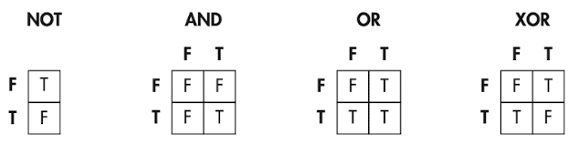

# 1 컴퓨터 내부의 언어 체계

모든 언어(구어, 문어, 몸짓 등)는 기호의 집합으로 encoding된다. 하지만 의미를 기호로 encoding하는 것만으로는 충분하지 않다. 당사자들이 모두 같은 context를 공유해서 같은 의미를 이해해야 한다.

---

## 1.1 bit(비트)

**bit**(비트)는 binary(이진) + digit(숫자)의 합성어다. (digit은 일상에서 쓰는 10진수를 뜻하기 때문에 어떻게 보면 기묘한 합성이다.)

bit는 2진법이기 때문에 두 가지 기호, 가령 모스 부호의 점(.)과 선(-) 중 하나만 담을 수 있다. 따라서 '기호의 순서'가 중요해 진다.

> 기호라는 개념은 추상적이다. on/off, 낮/밤, 쌀/보리 등 어떤 개념일 수도 있다.

---

## 1.1.1 logic operation(논리 연산)

bit 사용법 중 하나로 어떠한 질문에 true/false(예/아니요) 로 답을 표현하는 것이 있다. 다른 bit들이 표현하는 내용에서 새로운 bit를 만들어내는 이런 동작을 logic operation이라고 한다.

---

### 1.1.2 boolean algebra

boolean algebra(불리언 대수)는 1800년대 영국 수학자 George Boole이 만들었다. algebra라는 명칭에서 볼 수 있는 것처럼, bit에서 사용할 수 있는 연산 규칙의 집합이다.

일반 Algebra와 마찬가지로 결합 법칙, 교환 법칙, 분배 법칙을 적용할 수 있다.

기본적인 boolean algebra는 NOT, AND, OR 세 가지다.

- NOT: 논리적 반대. false인 bit에 NOT을 적용하면 true가 되고, true인 bit에 not을 하면 false가 된다.

- AND: 2개 이상의 bit에서 사용한다. 2 bit 연산의 경우 첫 번째 bit가 true라면, 두 번째 bit도 true여야 연산의 결과가 true가 된다.

- OR: 2개 이상의 bit에서 사용한다. 2 bit 연산의 경우 첫 번째나 두 번째 중 어느 하나만 true라면 연산의 결과가 true가 된다.

- XOR: exclusive OR. 첫 번째 bit와 두 번째 bit가 다른 값인 경우에만 true가 된다.

이런 boolean algebra를 truth table(진리표)를 이용해 시각적으로 볼 수 있다.

---

### 1.1.3 드모르간의 법칙

'a AND b 는 NOT(NOT a OR NOT b) 와 같다.'를 의미한다. 이 법칙을 이용하면 NOT을 이용해 AND 연산을 OR, 혹은 OR 연산을 AND로 대신할 수 있다.

positive logic(긍정적인 논리), negative logic(부정적인 논리)를 기술하는 명제에서 드모르간의 법칙을 이용할 수 있다.

---

### 1.1.4 정수를 비트로 표현하는 방법

1. 양의 정수 표현

주로 decimal number(10진수) 체계를 사용한다. 10가지 기호인 digit(숫자)를 사용하며, 이 체계는 지수의 base(밑)으로 10을 사용한다. 따라서 base-10 system이라고 부른다.

binary(2진법)은 기호가 2개이며 base-2 system이다. 아래 그림은 5,028을 2진법으로 나타낸 수다. 13bit 수가 된다.

4,096 + 512 + 256 + 128 + 32 + 4

- 가장 오른쪽 bit를 **least significant bit**(가장 작은 유효 비트)라고 부른다.

- 가장 왼쪽 bit를 **most significant bit**(가장 큰 유효 비트)라고 부른다.

이 둘을 줄여서 각각 LSB, MSB라고 부른다. 만약 위 5,028을 16bit 2진수로 저장하면 다음과 같다.

5,028을 2진수로 표현하려면 13비트가 필요했지만, 위는 16비트를 사용해서 표현했다. **leading zero**(리딩 제로), 즉 왼쪽에 0을 추가하므로써, 컴퓨터가 미리 정한 일정한 비트 수를 맞추는 것이다.

2진수 덧셈은 가장 오른쪽에 위치한 LSB부터 MSB 쪽으로 더하며 진행된다. 두 bit를 더한 값은 <U>두 bit를 XOR한 값과 같고</U>, 올림은 <U> 두 bit를 AND 한 값과 같다.</U> 

만약 덧셈 결과가 사용하는 bit 개수의 범위를 벗어난다면 overflow(오버플로)가 발생한다. 예를 들어 4bit 덧셈에서 1001( $9_{10}$ ) + 1000 ( $8_{10}$ )을 더한 결과는 10001( $17_{10}$ )이 되어야 한다. 하지만 사용할 수 있는 bit가 없기 때문에 결과가 0001( $1_{10}$ )이 된다.

>사실  컴퓨터에서는 **condition code register**(조건 코드 레지스터)가 있어서, 몇 가지 정보를 담아둔다. 이 정보 중에는 overflow bit(오버플로 비트)가 있고, 이 비트는 MSB에서 발생한 올림값이 들어가게 된다.

2. 음의 정수 표현

- sign and magnitude 표현법

앞서 4비트를 이용해 양의 정수를 표현하면, 0부터 15까지 총 16가지를 표현할 수 있었다. 그러나 이 중 한 bit를 sign(부호)로 사용하면 범위는 달라지지만 음수를 표현할 수 있다.

sign은 +와 -로 두 가지 값을 갖는다. MSB를 sign bit로 사용하며, 이로써 15가지 음수와 양수를 표현할 수 있다.(-7 ~ +7)

이렇게 한 bit를 sign으로 사용하고 나머지 bit를 수의 크기, 즉 '0에서부터의 거리'(절댓값)을 표현하기 위해 사용하는 방법을 sign and magnitude(부호와 크기) 표현법이라고 한다.

> 다만 이 방법은 널리 쓰이지 못하고 있는데, (1) 0을 표현하는 방법이 두 가지다, (2) XOR과 AND를 이용한 덧셈 계산을 사용할 수 없다.(맨 앞이 sign bit이므로 이를 구분해서 연산을 수행해야 한다.)

- one's complement 표현법

음수를 표현하는 또 다른 방법으로는 양수의 모든 bit를 뒤집는 방법이 있다. 이런 방법을 one's complement 표현법이라고 한다.

one's complement 또한 MSB를 sign bit로 사용한다. 대신 <U>음수를 양수에서 NOT 연산을 적용하여 얻은 complement</U>를 사용한다

| 부호 | $2^2$ | $2^1$ | $2^0$ | 10진수 |
| :---: | :---: | :---: | :---: | :---: |
| 0 | 1 | 1 | 1 | +7 |
| 0 | 1 | 1 | 0 | +6 |
| 0 | 1 | 0 | 1 | +5 |
| 0 | 1 | 0 | 0 | +4 |
| 0 | 0 | 1 | 1 | +3 |
| 0 | 0 | 1 | 0 | +2 |
| 0 | 0 | 0 | 1 | +1 |
| 0 | 0 | 0 | 0 | +0 |
| 0 | 0 | 0 | 0 | -0 |
| 1 | 1 | 1 | 0 | -1 |
| 1 | 1 | 0 | 1 | -2 |
| 1 | 1 | 0 | 0 | -3 |
| 1 | 0 | 1 | 1 | -4 |
| 1 | 0 | 1 | 0 | -5 |
| 1 | 0 | 0 | 1 | -6 |
| 1 | 0 | 0 | 0 | -7 |

> 하지만 이 방식도 0을 두 개 사용하며, 여전히 덧셈을 적용하기 어렵다.

덧셈 문제를 해결하려면 MSB 올림이 발생한 경우, LSB 쪽으로 올림을 전달해야 한다. 이를 **end-around carry**(순환 올림)이라고 한다.

가령 4비트 2진수 0010( $2_{10}$ ) + 1110( $-1_{10}$ ) 덧셈을 계산하게 되면, MSB에서 올림이 발생하게 된다. 원래라면 10000이 될 수이지만, 최종 결과는 end-around carry를 적용해 0000에 1을 더한 0001( $1_{10}$ )이 된다.

> 에초에 음수가 양수의 complement으로 정했기 때문에, -n을 더했다는 말은 n+1과 함께  모두 증발하며 MSB에서 올림을 발생시킨다. 따라서 이런 덧셈이 성립할 수 있다.

> 하지만 여전히 번거롭다.

- two's complement

two's complement(2의 보수) 표현법이야 말로 부호가 있는 정수를 표현할 때 가장 널리 쓰이는 방법이다. 

음수를 양수에서 NOT을 취해 얻은 complement+1로 나타낸다.

| 부호 | $2^2$ | $2^1$ | $2^0$ | 10진수 |
| :---: | :---: | :---: | :---: | :---: |
| 0 | 1 | 1 | 1 | +7 |
| 0 | 1 | 1 | 0 | +6 |
| 0 | 1 | 0 | 1 | +5 |
| 0 | 1 | 0 | 0 | +4 |
| 0 | 0 | 1 | 1 | +3 |
| 0 | 0 | 1 | 0 | +2 |
| 0 | 0 | 0 | 1 | +1 |
| 0 | 0 | 0 | 0 | +0 |
| 1 | 1 | 1 | 1 | -1 |
| 1 | 1 | 1 | 0 | -2 |
| 1 | 1 | 0 | 1 | -3 |
| 1 | 1 | 0 | 0 | -4 |
| 1 | 0 | 1 | 1 | -5 |
| 1 | 0 | 1 | 0 | -6 |
| 1 | 0 | 0 | 1 | -7 |
| 1 | 0 | 0 | 0 | -8 |

앞선 표현법과 다르게 0을 표현하는 방법이 1가지 뿐으로 더 효율적이다. 또한 올림 비트를 굳이 end-around carry할 필요 없이 무시하기만 해도 연산이 가능하다.

two's complement로 표현할 수 있는 값의 범위를 기억해 두면 유용하다.

| bit 수 | 값의 개수 | 값의 범위 |
| --- | --- | --- |
| 4 | $2^4$ | -8~7 |
| 8 | $2^8$ | -128~127 |
| 12 | $2^12$ | -2048~2047 |
| 16 | $2^16$ | -32768~32767 |
...

---

