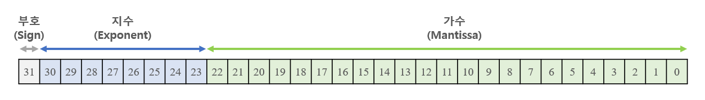

# 1 컴퓨터 내부의 언어 체계

모든 언어(구어, 문어, 몸짓 등)는 기호의 집합으로 encoding된다. 하지만 의미를 기호로 encoding하는 것만으로는 충분하지 않다. 당사자들이 모두 같은 context를 공유해서 같은 의미를 이해해야 한다.

---

## 1.1 bit(비트)

**bit**(비트)는 binary(이진) + digit(숫자)의 합성어다. (digit은 일상에서 쓰는 10진수를 뜻하기 때문에 어떻게 보면 기묘한 합성이다.)

bit는 2진법이기 때문에 두 가지 기호, 가령 모스 부호의 점(.)과 선(-) 중 하나만 담을 수 있다. 따라서 '기호의 순서'가 중요해 진다.

> 기호라는 개념은 추상적이다. on/off, 낮/밤, 쌀/보리 등 어떤 개념일 수도 있다.

---

## 1.1.1 logic operation(논리 연산)

bit 사용법 중 하나로 어떠한 질문에 true/false(예/아니요) 로 답을 표현하는 것이 있다. 다른 bit들이 표현하는 내용에서 새로운 bit를 만들어내는 이런 동작을 logic operation이라고 한다.

---

### 1.1.2 boolean algebra

boolean algebra(불리언 대수)는 1800년대 영국 수학자 George Boole이 만들었다. algebra라는 명칭에서 볼 수 있는 것처럼, bit에서 사용할 수 있는 연산 규칙의 집합이다.

일반 Algebra와 마찬가지로 결합 법칙, 교환 법칙, 분배 법칙을 적용할 수 있다.

기본적인 boolean algebra는 NOT, AND, OR 세 가지다.

- NOT: 논리적 반대. false인 bit에 NOT을 적용하면 true가 되고, true인 bit에 not을 하면 false가 된다.

- AND: 2개 이상의 bit에서 사용한다. 2 bit 연산의 경우 첫 번째 bit가 true라면, 두 번째 bit도 true여야 연산의 결과가 true가 된다.

- OR: 2개 이상의 bit에서 사용한다. 2 bit 연산의 경우 첫 번째나 두 번째 중 어느 하나만 true라면 연산의 결과가 true가 된다.

- XOR: exclusive OR. 첫 번째 bit와 두 번째 bit가 다른 값인 경우에만 true가 된다.

이런 boolean algebra를 truth table(진리표)를 이용해 시각적으로 볼 수 있다.

---

### 1.1.3 드모르간의 법칙

'a AND b 는 NOT(NOT a OR NOT b) 와 같다.'를 의미한다. 이 법칙을 이용하면 NOT을 이용해 AND 연산을 OR, 혹은 OR 연산을 AND로 대신할 수 있다.

positive logic(긍정적인 논리), negative logic(부정적인 논리)를 기술하는 명제에서 드모르간의 법칙을 이용할 수 있다.

---

### 1.1.4 정수를 비트로 표현하는 방법

1. 양의 정수 표현

주로 decimal number(10진수) 체계를 사용한다. 10가지 기호인 digit(숫자)를 사용하며, 이 체계는 지수의 base(밑)으로 10을 사용한다. 따라서 base-10 system이라고 부른다.

binary(2진법)은 기호가 2개이며 base-2 system이다. 아래 그림은 5,028을 2진법으로 나타낸 수다. 13bit 수가 된다.

4,096 + 512 + 256 + 128 + 32 + 4

- 가장 오른쪽 bit를 **least significant bit**(가장 작은 유효 비트)라고 부른다.

- 가장 왼쪽 bit를 **most significant bit**(가장 큰 유효 비트)라고 부른다.

이 둘을 줄여서 각각 LSB, MSB라고 부른다. 만약 위 5,028을 16bit 2진수로 저장하면 다음과 같다.

5,028을 2진수로 표현하려면 13비트가 필요했지만, 위는 16비트를 사용해서 표현했다. **leading zero**(리딩 제로), 즉 왼쪽에 0을 추가하므로써, 컴퓨터가 미리 정한 일정한 비트 수를 맞추는 것이다.

2진수 덧셈은 가장 오른쪽에 위치한 LSB부터 MSB 쪽으로 더하며 진행된다. 두 bit를 더한 값은 <U>두 bit를 XOR한 값과 같고</U>, 올림은 <U> 두 bit를 AND 한 값과 같다.</U> 

만약 덧셈 결과가 사용하는 bit 개수의 범위를 벗어난다면 overflow(오버플로)가 발생한다. 예를 들어 4bit 덧셈에서 1001( $9_{10}$ ) + 1000 ( $8_{10}$ )을 더한 결과는 10001( $17_{10}$ )이 되어야 한다. 하지만 사용할 수 있는 bit가 없기 때문에 결과가 0001( $1_{10}$ )이 된다.

>사실  컴퓨터에서는 **condition code register**(조건 코드 레지스터)가 있어서, 몇 가지 정보를 담아둔다. 이 정보 중에는 overflow bit(오버플로 비트)가 있고, 이 비트는 MSB에서 발생한 올림값이 들어가게 된다.

2. 음의 정수 표현

- sign and magnitude representation

앞서 4비트를 이용해 양의 정수를 표현하면, 0부터 15까지 총 16가지를 표현할 수 있었다. 그러나 이 중 한 bit를 sign(부호)로 사용하면 범위는 달라지지만 음수를 표현할 수 있다.

sign은 +와 -로 두 가지 값을 갖는다. MSB를 sign bit로 사용하며, 이로써 15가지 음수와 양수를 표현할 수 있다.(-7 ~ +7)

이렇게 한 bit를 sign으로 사용하고 나머지 bit를 수의 크기, 즉 '0에서부터의 거리'(절댓값)을 표현하기 위해 사용하는 방법을 sign and magnitude(부호와 크기) 표현법이라고 한다.

> 다만 이 방법은 널리 쓰이지 못하고 있는데, (1) 0을 표현하는 방법이 두 가지다, (2) XOR과 AND를 이용한 덧셈 계산을 사용할 수 없다.(맨 앞이 sign bit이므로 이를 구분해서 연산을 수행해야 한다.)

- one's complement representation

음수를 표현하는 또 다른 방법으로는 양수의 모든 bit를 뒤집는 방법이 있다. 이런 방법을 one's complement 표현법이라고 한다.

one's complement 또한 MSB를 sign bit로 사용한다. 대신 <U>음수를 양수에서 NOT 연산을 적용하여 얻은 complement</U>를 사용한다

| 부호 | $2^2$ | $2^1$ | $2^0$ | 10진수 |
| :---: | :---: | :---: | :---: | :---: |
| 0 | 1 | 1 | 1 | +7 |
| 0 | 1 | 1 | 0 | +6 |
| 0 | 1 | 0 | 1 | +5 |
| 0 | 1 | 0 | 0 | +4 |
| 0 | 0 | 1 | 1 | +3 |
| 0 | 0 | 1 | 0 | +2 |
| 0 | 0 | 0 | 1 | +1 |
| 0 | 0 | 0 | 0 | +0 |
| 0 | 0 | 0 | 0 | -0 |
| 1 | 1 | 1 | 0 | -1 |
| 1 | 1 | 0 | 1 | -2 |
| 1 | 1 | 0 | 0 | -3 |
| 1 | 0 | 1 | 1 | -4 |
| 1 | 0 | 1 | 0 | -5 |
| 1 | 0 | 0 | 1 | -6 |
| 1 | 0 | 0 | 0 | -7 |

> 하지만 이 방식도 0을 두 개 사용하며, 여전히 덧셈을 적용하기 어렵다.

덧셈 문제를 해결하려면 MSB 올림이 발생한 경우, LSB 쪽으로 올림을 전달해야 한다. 이를 **end-around carry**(순환 올림)이라고 한다.

가령 4비트 2진수 0010( $2_{10}$ ) + 1110( $-1_{10}$ ) 덧셈을 계산하게 되면, MSB에서 올림이 발생하게 된다. 원래라면 10000이 될 수이지만, 최종 결과는 end-around carry를 적용해 0000에 1을 더한 0001( $1_{10}$ )이 된다.

> 에초에 음수가 양수의 complement으로 정했기 때문에, -n을 더했다는 말은 n+1과 함께  모두 증발하며 MSB에서 올림을 발생시킨다. 따라서 이런 덧셈이 성립할 수 있다.

> 하지만 여전히 번거롭다.

- two's complement

two's complement(2의 보수) 표현법이야 말로 부호가 있는 정수를 표현할 때 가장 널리 쓰이는 방법이다. 

음수를 양수에서 NOT을 취해 얻은 complement+1로 나타낸다.

| 부호 | $2^2$ | $2^1$ | $2^0$ | 10진수 |
| :---: | :---: | :---: | :---: | :---: |
| 0 | 1 | 1 | 1 | +7 |
| 0 | 1 | 1 | 0 | +6 |
| 0 | 1 | 0 | 1 | +5 |
| 0 | 1 | 0 | 0 | +4 |
| 0 | 0 | 1 | 1 | +3 |
| 0 | 0 | 1 | 0 | +2 |
| 0 | 0 | 0 | 1 | +1 |
| 0 | 0 | 0 | 0 | +0 |
| 1 | 1 | 1 | 1 | -1 |
| 1 | 1 | 1 | 0 | -2 |
| 1 | 1 | 0 | 1 | -3 |
| 1 | 1 | 0 | 0 | -4 |
| 1 | 0 | 1 | 1 | -5 |
| 1 | 0 | 1 | 0 | -6 |
| 1 | 0 | 0 | 1 | -7 |
| 1 | 0 | 0 | 0 | -8 |

앞선 표현법과 다르게 0을 표현하는 방법이 1가지 뿐으로 더 효율적이다. 또한 올림 비트를 굳이 end-around carry할 필요 없이 무시하기만 해도 연산이 가능하다.

two's complement로 표현할 수 있는 값의 범위를 기억해 두면 유용하다.

| bit 수 | 값의 개수 | 값의 범위 |
| --- | --- | --- |
| 4 | $2^4$ | -8~7 |
| 8 | $2^8$ | -128~127 |
| 12 | $2^12$ | -2048~2047 |
| 16 | $2^16$ | -32768~32767 |
...

---

### 1.1.5 실수를 표현하는 방법

decimal number의 경우 소수점으로 decimal point(10진 소수점)을 쓴다. 마찬가지로 binary도 2진 소수점을 표현할 방법이 필요하다.

- fixed-point representation

비트에서 소수점의 위치를 임의로 정해서 쓰는 방법이다. 예를 들어 4비트에서 2비트를 분수 표현으로 쓰고, 나머지 2비트는 정수 부분을 표현하는 데 쓸 수 있다.

| 정수 | | ... | 분수 | | 값
| --- | --- | --- | --- | --- | --- |
| 0 | 0 | . | 0 | 0 | 0 |
| 0 | 0 | . | 0 | 1 | $1 \over 4$ |
| 0 | 0 | . | 1 | 0 | $1 \over 2$ |
| 0 | 0 | . | 1 | 1 | $3 \over 4$ |
| 0 | 1 | . | 0 | 0 | 1 |
| 0 | 1 | . | 0 | 1 | 1 $1 \over 4$ |
| 0 | 1 | . | 1 | 0 | 1 $1 \over 2$ |
| 0 | 1 | . | 1 | 1 | 1 $3 \over 4$ |
...

잘 작동하는 표현법이지만, 실수를 표현하기 위해 필요한 비트 개수가 너무 많기 때문에 사용하는 경우는 드물다.

> digital signal processor(디지털 신호 처리 장치) 등 특별한 목적에 쓰이는 일부 컴퓨터는 여전히 fixed point를 사용한다.

> 사실 일반적인 문제를 해결하기 위해서는 컴퓨터가 엄청나게 넓은 범위의 수를 다룰 줄 알아야 한다. 가령 Planck's constant(플랑크 상수)는 $6.63 \times 10^{-34}J/s$ 이다. 또한 Avogadro's constant(아보가드로 수)는 $6.02 \times 10^{23}$ /몰이다. 이런 수를 fixed-point로 표현하기에는 메모리 비용이 너무 많이 소요될 것이다.

- floating-point representation

floating-point 표기법에서는 scientific notation(과학적 표기법)을 적용해야 한다. 예시를 보면 간단히 이해할 수 있다. 가령 $1.2 \times 10^{-3}$ 처럼 exponent(지수)를 이용해서 표기한 것이 바로 예시다.

> 비트 상 소수점의 위치가 같으므로 floating-point라는 말 자체가 의아할 수 있지만, 지수에 따라 $1.2 \times 10^{0}$ , $1.2 \times 10^{2}$ 처럼 소수점이 바뀌는 점을 생각하면 납득할 수 있다.

아래는 4 bit floating-point 표현을 나타낸 표다.

| 가수(mantissa) ||| 지수 || 값 |
| --- | --- | --- | --- | --- | --- |
| 0 | . | 0 | 0 | 0 | 0( $0 \times 2{^0}$ ) |
| 0 | . | 0 | 0 | 1 | 0( $0 \times 2{^1}$ ) |
| 0 | . | 0 | 1 | 1 | 0( $0 \times 2{^2}$ ) |
| 0 | . | 0 | 1 | 1 | 0( $0 \times 2{^3}$ ) |
| 0 | . | 1 | 0 | 0 | ${1 \over 2}$ ( ${1 \over 2} \times 2{^0}$ ) |
| 0 | . | 1 | 0 | 1 | 1.0 ( ${1 \over 2} \times 2{^1}$ ) |
| 0 | . | 1 | 1 | 0 | 2.0 ( ${1 \over 2} \times 2{^2}$ ) |
| 0 | . | 1 | 1 | 1 | 4.0 ( ${1 \over 2} \times 2{^3}$ ) |
| 1 | . | 0 | 0 | 0 | 1.0 ( $1 \times 2{^0}$ ) |
| 1 | . | 0 | 0 | 1 | 2.0 ( $1 \times 2{^1}$ ) |
| 1 | . | 0 | 1 | 0 | 4.0 ( $1 \times 2{^2}$ ) |
| 1 | . | 0 | 1 | 1 | 8.0 ( $1 \times 2{^3}$ ) |
| 1 | . | 1 | 0 | 0 | 1.5 ( ${3 \over 2} \times 2{^0}$ ) |
...

하지만 이런 floating-point 역시 비효율적이다. 숫자 하나에 겹치는 방법이 너무 많아서 낭비되는 부분이 상당수 생긴다. 

게다가 floating-point 표현법은 모든 가능한 수를 표현하지 못한다. 0.5 + 0.5 = 1은 간단하지만, 6.5를 표현하는 bit 패턴은 없기 때문에 어떻게 계산해야 할지 분석해야 하는 필요까지 생긴다.

> 이런 부정확한 계산을 추적하고 개선하는 분야가 numerical analysis(수치 해석)이다.

이럼에도 불구하고 컴퓨터에서 계산을 수행할 때 실수를 표현하는 표준 방법에 해당한다.

> IEEE 754라는 표준을 사용한다. 가수와 지수 각각에 sign bit를 사용하지만, 지수에 해당하는 sign bit는 지수의 bit 패턴 속에 포함되어 있다. 그리고 낭비되는 부분을 최소화하기 위한 여러 트릭을 사용한다.

- IEEE floating-point 표준

한 가지 트릭은 바로 **normalization**(정규화)이 있다. normalization은 가수를 조정해서 맨 앞에 0이 없도록 만든다.

두 번째 트릭은, normalization에 따라 가수의 맨 왼쪽 bit가 1이라는 사실을 알고 있으므로, 이를 생략하는 것이다. 이를 이용해서 가수에 1비트를 더 사용할 수 있게 된다.

또한 자주 쓰이는 두 가지 floating-point 수가 있다.

1. single precision(기본 정밀도) floating-point

32bit를 사용하며 7bit 정밀도로 대략 $\pm 10^{\pm 38}$ 정도의 범위를 표현할 수 있다.

2. double precision(2배 정밀도) floating-point

64bit를 이용하며 15비트 정밀도로 대략 $\pm 10^{\pm 308}$ 정도의 범위를 표현할 수 있다.

- S: sign 

- single precision보다 지수가 3bit 더 크고, 기수가 29bit 더 크다.

> 둘 모두 가수가 가진 sign을 나타내는 sign bit를 사용한다.

> 반대로 이런 장점은 bit를 2배나 더 많이 사용한다는 비용을 지불하고 얻은 것이다.

그런데 가수랑 다르게 지수는 sign bit가 따로 존재하지 않는 모습을 볼 수 있다. 기술자들은 지수 bit가 모두 0이거나 1인 경우 특별한 의미를 갖게 하는 **biased** 지숫값을 사용했다. 

예를 들어 single precision의 경우 biased value $127_{10}$ (01111111)이 지수 0을 표현한다. 2진수에서 1을 표현하는 bit 패턴(00000001)은  지수에서 -126을 표현하며, 2진수 11111110은 +127을 표현한다.

게다가 IEEE 754는 0으로 나눴을 때 생길 수 있는 양의 무한대, 음의 무한대나 NaN(Not A Number)를 표현하는 bit 패턴 등 여러 특별한 bit 패턴을 제공한다.

> NaN(Not A Number)는 잘못된 산술 연산을 수행했다는 의미다.

---

## 1.2 다른 방식의 수 표현

2진수는 사람들이 파악하기 어렵기 때문에, 더 읽기 쉽게 표현할 수 있는 여러 방법을 개발했다.

- octal representation(8진 표현법)

간단히 binary bit들을 3개씩 그룹으로 나눈다고 생각하면 편하다.

| 100 | 101 | 110 | 001 | 010 | 100 |
| :---: | :---: | :---: | :---: | :---: | :---: |
| 4 | 5 | 6 | 1 | 2 | 4 |

- hexadecimal representation(16진 표현법)

최근에는 8진 표현법보다는 16진 표현법이 잘 쓰이고 있다. 왜냐하면 최근 컴퓨터 내부는 8bit 배수를 사용해서 만들어지기 때문이다. 

16진법이기 때문에 기존의 0~9까지 10개 숫자로는 부족하다. 따라서 ABCDEF라는 6개 숫자를 더 넣어서 10, 11, 12, 13, 14, 15를 맡는다.

간단히 binary bit를 4개씩 그룹으로 나눈다고 생각하면 편하다.

| 1101 | 0011 | 1111 | 1100 | 0001 |
| :---: | :---: | :---: | :---: | :---: |
| d | 3 | f | c | 1 |

> 이와 같은 8의 배수들은 3으로는 균일하게 나눠지지 않는다.

참고로 여러 프로그래밍 언어에서는 다음과 같은 표기법으로 진법이 무엇인지 나타낸다.

- 0으로 시작하는 숫자: octal. 예를 들어 017(10진수로 15)

- 0x가 앞에 붙은 숫자: hexadecimal. 예를 들어 0x12f(10진수로 303)

> C++에서는 0b라는 접두사로 binary를 표현하기도 한다.

---

### 1.2.1 bit group의 이름

bit는 너무 작아서 기본 단위로 사용하기에는 유용하지 않다. 따라서 bit를 좀 더 큰 덩어리로 조직화해야 하는데, 예를 들어 허니웰 6000 시리즈 컴퓨터는 36bit 덩어리를 기본으로 했다.

시간이 들어 8bit 덩어리가 기본 단위로 널리 쓰이기 시작했고, 이를 **byte**라고 부른다.

| 이름 | bit 개수 |
| --- | --- |
| neeble | 4 | 
| byte | 8 |
| half word | 16 |
| word | 32 |
| double word | 64 |

> 여기서 word는 각 컴퓨터가 설계상 자연스럽게 사용할 수 있는 bit 묶음의 크기를 가리킨다.

---

## 1.3 텍스트 표현

수와 마찬가지로 텍스트를 표현하는 방법도 여러 아이디어가 경쟁했다.

- ASCII

ASCII(American Standard Code for Information Interchange), 아스키는 키보드에 있는 모든 기호에 <U>7bit 수</U>를 할당한 체계이다. 예를 들어 $65_{10}$ ( $41_{16}$ 혹은 0x41 ) 는 대문자 A를, $77_{10}$ ( $4\mathsf{D}_{16}$ 혹은 0x4D ) 은 대문자 M를 표현한다.

> 이런 이유로 아스키는 8진수로 표현할 때가 많다.

또한 ASCII에는 키보드에 있는 기호 말고도 몇 가지 재미있는 코드를 가지고 있는데, 이들은 글자 출력을 위한 것이 아니라 장치를 제어하기 위해 사용한다. 따라서 **control character**(제어 문자)라고 한다.

> 상당수가 통신 control을 위한 문자다. 예를 들어 ACK(수신확인)과 NAK(반수신확인, 메세지를 받지 못했음)이 대표적이다.

- 이외 국가 문자를 표현

ISO(International Standards Organization), 국제 표준화 기구는 ISO-646, ISO-8859를 도입했다. 아스키를 확장해 유럽 언어에 필요한 액센트 기호나 그 밖의 발음 구별 기호를 추가했다.

이외 JIS(일본 산업 표준) 위원회는 일본 문자를 표현하기 위해 JISX 0201을 만들었다. 그리고 중국어, 아랍어, 한국어(KS C 5601) 등의 표준도 생겼다.

그러나 당시까지는 bit가 지금보다 더 비싼 시절이라 7~8bit로 표현을 만들었지만, 현대에 와서는 16bit로 표현하는 **Unicode**라는 새로운 표준을 만들었다.

하지만 이 16bit도 모자른 탓에 21bit까지 확장이 됐으며, 이 정도로 지구상의 모든 문자를 다 담을 수 있을 것이라고 예상하고 있다.

---

### 1.3.1 UTF-8

Unicode는 16bit를 사용하지만, 고스란히 16bit를 다 사용하면 낭비되는 bit가 많을 수 있다. 따라서 unicode는 여러 encoding을 사용해 이런 문제를 해결한다.

> encoding은 다른 bit 패턴을 표현하기 위해 사용하는 bit 패턴을 일컫는다.

이 중에서도 8bit 덩어리로 encoding하는 **UTF-8**(Unicode Transformation Format-8 bit)라는 encoding 방식이 하위 호환성이나 효율성 면에서 우수하여 널리 쓰이고 있다. UTF-8은 모든 아스키 문자를 8bit로 표현하기 때문에 아스키 데이터를 encoding할 때 추가 공간이 필요하지 않다.

게다가 아스키가 아닌 문자에서도 UTF-8은, 아스키를 받아서 처리하는 프로그램이 깨지지 않도록 문자를 encoding한다.

아래는 UTF-8의 특성이다.

- UTF-8은 8bit 덩어리, 즉 **octet**(옥텟) 시퀀스로 encoding한다.

- 첫 번째 octet의 MSB 쪽 bit들이 시퀀스의 길이를 표현한다. 따라서 문자의 경계가 어딘지 식별하기 쉽다.

몇몇 변환 예시를 보자.

16bit인 유니코드 문자 A(0x0041)을 UTF-8로 변환하면 UTF-8 문자 A(0x41)이 된다.

- Unicode A(0x0041)는 7bit 하나로 다 표현할 수 있다. 따라서 octet의 첫 번째에 해당하는 MSB는 0으로 설정한다.

16bit인 유니코드 문자 $\pi$ (0x03C0)을 UTF-8로 변환하면 UTF-8 문자 $\pi$ (0xCF 0x80)이 된다.

- Unicode $\pi$ (0x03C0)은 7bit 하나에 다 들어가지 않는다. 대신 이 값은 11bit로 표현할 수 있다. 따라서 두 개의 octet을 사용한다.

- 첫 번째 octet의 MSB는 시퀀스를 나타내기 위해 3bit를 할당해서 110, 두 번째 octet도 시퀀스를 나타내기 위해 2bit로 10을 표기한다. 

> MSB가 나타내는 sequence보다 실제 할당된 bit 지점은 하나가 더 작다.(0에서부터 시작하므로)

16bit인 유니코드 문자 '♣' (0x2663)을 UTF-8로 변환하면 UTF-8 문자 '♣' (0xE2 0x99 0xA3)이 된다.

- 2개의 octet을 사용하되, 첫 번째 octet의 MSB는 1110으로 시작하게 한다. 나머지 두 octet은 10으로 시작한다.

---

## 1.4 문자를 사용한 수 표현

UTF-8는 문자를 수로 표현했다. 하지만 반대로 수를 문자로 표현할 수도 있다.

원래 컴퓨터 통신에서 binary 데이터를 직접 보내기는 쉽지 않았다. 아스키 코드 상당수가 control character였고, 이런 control character는 시스템마다 처리하는 방식이 달랐기 때문이다.

> 심지어 몇몇 시스템은 7bit만 송수신할 수 있기도 했다.

- QP encoding(Quoted-Printable encoding)

QP encoding은 전자우편 첨부를 처리하기 위해 만들어 졌다. 말 그대로 '출력 가능하게 변경한 인코딩'이며, octet 데이터를 7bit 데이터만 지원하는 통신 경로로 송수신하기 위한 encoding이다.

8bit 수를 (1) =을 앞에 붙이고 (2) byte의 각 neeble을(bit 4묶음인 걸 기억하자) 표현하는 hexadecimal 숫자 2개를 추가해서 표현한다.

> =가 이런 기능을 하기 때문에, =를 표현하려면 =3D로 표현해야 한다.

또한 몇 가지 추가 규칙이 있다.

- 줄 맨 끝에 tab과 space가 있다면, 이들을 각각 =09, =20으로 표현한다.

- encoding된 데이터는 한 줄이 76자를 넘을 수 없다.

- 어떤 줄 맨 뒤가 =로 끝나면 soft line break(가짜 줄바꿈)

> 문서 편집기나 웹 브라우저에서 문자열 행을 자동으로 다음 줄에 보이게 하는 기능을 뜻한다.

수신 쪽에서는 QP encoding 데이터를 다시 decoding하는데, 이 =를 제거하고 해석한다.

- base64 encoding

QP encoding이 잘 작동하긴 해도 1byte를 위해 3byte를 이용하므로 매우 비효율적이다.

base64 encoding은 3byte 데이터를 4문자로 표현한다. 3byte 데이터, 즉 24bit를 6bit 네 덩어리로 나누고, 각 덩어리에 문자를 할당한다.

가령 0, 1, 2라는 세 byte를 인코딩하면 다음과 같이 AAEC가 된다.

그런데 원본 데이터가 3byte의 배수라는 보장은 없다. 이때는 padding을 적용한다. 1byte가 남으면 =을 붙이고, 2byte가 남으면 ==를 붙인다.

- URL encoding

웹 페이지 URL도 비슷한 방식을 사용한다. URL에서 %26이나 %2F와 같은 문자 시퀀스가 바로 URL encoding을 거친 것이다. 주의할 부분은 이런 시퀀스가 **literal**(문자에 특별한 의미가 담기지 않은 '문자 그 자체')이라는 점이다.

byte가 기본 단위, 즉 8bit 묶음이 기본이므로, 16bit(Unicode)에서 각 octet은 % 뒤에 2개의 hexadecimal를 붙여서 표현한다. 

> %를 붙이기 때문에 percent-encoding이라고 부르기도 한다.

> 참고로 URL에서 /는 특별한 의미를 가지기 때문에, /를 %2F라는 문자열로 대신한다.

---

## 1.5 색 표현

computer graphics(컴퓨터 그래픽스)는 pixel을 찍는 과정이다. 기본이 되는 RGB color model은 다음과 같이 color cube로 표현할 수 있다.

여러 예시 색을 표시하면 다음과 같다.

현대 컴퓨터는 24bit를 사용해서 색을 표현하며, 세 가지 RGB를 담당하는 8bit 필드로 나눈다.

그러나 현대 컴퓨터들이 표준 크기로 32bit(word)를 사용함에 따라 사용하지 않는 8bit가 생기게 됐다.

하지만 이 8bit는 transparency를 다루게 되면서 유용하게 되었다. 이를 RGBα 라고 한다.

각 색에도 α를 곱해준 값을 저장한다. 따라서 이미지 합성은 색값을 α로 곱하는 과정을 거친다.

- color encoding

웹 페이지에서 UTF-8 문자 시퀀스로 구성된 text의 색을 나타내기 위한 방법이 필요했다. color encoding은 URL encoding과 비슷한 방식으로 표현하는데, #뒤에 여섯 자리 hexadecimal 숫자를 추가해서 표현한다.

##rrggbb처럼 표현할 수 있으며, 여기서 rr은 빨강, gg는 녹색, bb는 파랑을 뜻한다. #000000은 검은색, #ffffff는 흰색이다.

---