# 2 전자 회로의 조합 논리

오늘날 컴퓨터 clock speed(클록 속도)는 4GHz이며, 이는 1초에 40억 가지 계산을 처리할 수 있다는 뜻이다.

40억 분에 1초 동안 전자가 이동할 수 있는 거리는 75mm뿐인데, CPU는 한 면이 18mm이다. 따라서 겨우 CPU를 두 번 왕복할 정도인데, 앞으로 CPU가 더 줄일 수 있다면 성능은 더 높아질 것이다.

하지만 현대 컴퓨터 칩 내부의 선은 서로 몇 nm 단위로 떨어져 있다. 이 때문에 crosstalk(누화) 효과가 발생할 수 있으며, 이를 방지하기 위해 더 높은 noise immunity를 갖는 디지털 회로를 사용해야 한다.(판정 기준이 필요하다.)

---

## 2.1 analog to digital

여러 엔지니어 및 과학자가 transfer function(전이 함수)를 어떻게 변환할지 고민했다.

아래는 카메라 센서의 transfer function 그래프다.

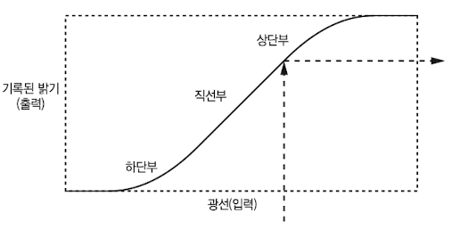

- x축: input. 광량

- y축: output. 센서가 기록한 빛

그래프를 보면 광량이 많을수록 이미지 노출이 과해지고, 적을수록 이미지 노출이 부족해지는 것을 알 수 있다. 그렇기 때문에 목표는 그래프의 **직선부**에 많이 닿게 해야 한다.

예를 들어 카메라는 주로 셔터 속도나 조리개를 조절하는 장치를 만들어서 그래프의 직선부에 해당하는 결과를 얻을 수 있게 조절한다. 

> 비슷하게 스피커나 이어폰에 들어 있는 amplifier circuit(증폭 회로)도 이런 트릭에 속한다.

- gain 조절

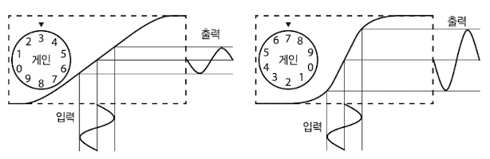

볼륨과 같은 장치는 **gain**을 조절한다. gain은 곡선의 기울기 가파름를 조절한다. 하지만 gain을 너무 크게 조절하면 output이 더 이상 input과 비슷한 모양을 유지하지 못한다.

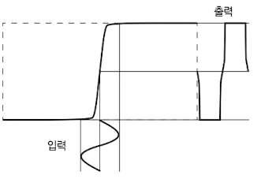

이처럼 **threshold**를 넘어버리면 output의 모양이 **distortion**(왜곡)된다. 그런데, 이 <U>distortion을 잘 이용하면, continuous한 신호를 discrete한 신호로 바꿀 수 있다.</U>

---

## 2.1.1 bit와 distortion

10진법보다 bit를 사용하면 바로 이런 하드웨어를 구현하는 것에서 이점을 얻을 수 있다.

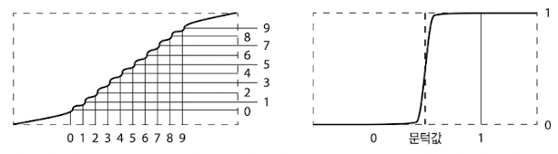

10진법 즉, 10가지 threshold를 이용해서 transfer function을 구분할 간단한 방법은 존재하지 않는다. 하지만 2진법이라면 훨씬 간단하게 이를 구현할 수 있다.

참고로 이렇게 활용하는 function의 하단부 영역을 **cutoff**라고 하며, 상단부 영역을 **saturation**이라고 한다.

---

## 2.2 논리 연산 구현

연산 규칙은 밸브를 생각하면 구현이 어떻게 되는지 이해하기 쉽다. 실제로 gate 밸브가 손잡이를 이용해 밸브를 열고 닫듯이, 회로에서도 이런 절차가 일어난다.

이 밸브를 두 개 연결한다고 하자. 밸브는 직렬(series)이나 병렬(parallel)로 연결할 수 있다.

- AND: 밸브 두 개의 series connection

  - 두 밸브가 모두 열려야 true가 된다.

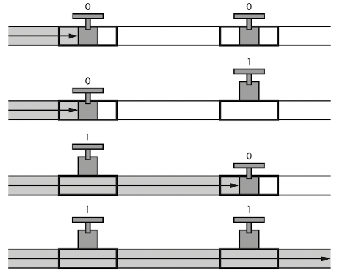

- OR: 밸브 두 개의 parallel connection

  - 두 밸브 중 하나만 열려도 true가 된다.

> 밸브에서 gate를 열고 물이 전달되는 데까지 시간이 걸리는 것처럼, 전기도 마찬가지다. 이런 효과를 **propagation delay**(전파 지연)이라고 한다.

> 온도나 여러 조건에 따라 흐름이 결정된다.

resistance(저항)도 비슷하게 묘사할 수 있다.

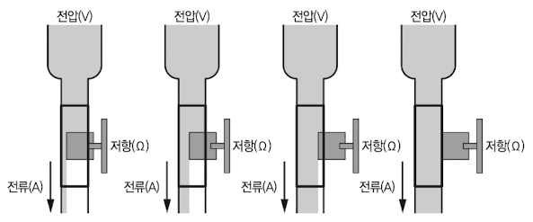

처음에는 전기 회로에서 이런 gate를 조절하는 역할은 대체로 코일이 담당했다.(아래와 같은 구조를 릴레이라고 한다.) 코일에 전력이 유도되면서, 스위치가 동작하게 된다.

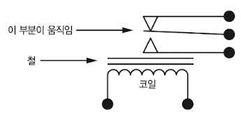

또한 이런 점을 이용해서 NOT 연산을 구현할 수도 있다.

> 이런 구현 방식은 접점에 이물질이 있으면 오류가 발생하기도 했다. 실제로 나방이 끼면서 작동하지 않은 것에서 bug라는 단어가 탄생했다.

> 또한 코일의 전원을 갑자기 차단하면 순간적으로 초고압이 발생하기 때문에, 공기에도 전기가 통할 수 있다. 이런 현상이 마모를 일으키기도 한다.

그 다음에는 진공관을 이용했으며, 더 나아가서 익숙한 트랜지스터가 탄생한다. 하지만 트랜지스터를 사용해도 AND 함수 같은 간단한 회로를 만들 때조차 부품이 너무 많이 필요했다.

> transistor(트랜지스터)는 transfer resistor(전송 저항)을 줄인 말에서 탄생했다. semiconductor(반도체)를 사용해서 만든다.

> 가장 보편적이며 중요한 트랜지스터는 BJT(Bipolar junction transistor)와 FET(Field effect transistor)다.

그 다음으로 나온 것이 바로 **intergrated circuit**(집적 회로)이며, 복잡한 시스템을 트랜지스터 하나를 만드는 정도의 비용으로 만들 수 있다.

---

## 2.3 논리 게이트

아래는 논리 게이트를 표현하는 기호이다. 2-input gate를 중점으로 설명한다.

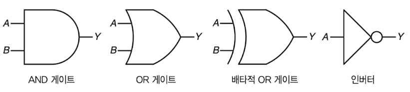

inverter(인버터) 기호의 ○를 유의하자. ○가 없는 경우 buffer(버퍼)에 해당되며, buffer는 단지 input을 output으로 전달하기만 한다. 반면 inverter는 input을 반전시켜 output으로 전달한다.

> ○는 출력을 반전시킨다는 의미이다.

그런데 AND나 OR 게이트가 가장 효율적이지는 않다. TTL(transistor-transistor logic, 트랜지스터-트랜지스터 논리)든 CMOS(complementary metal–oxide–semiconductor)든 논리 게이트에서 가장 단순한 회로는 **NAND**(not and)나 **NOR**(not or)이다.

- NAND, NOR은 트랜지스터는 2개(TTL)나 4개(CMOS) 사용한다.(아래 그림이 CMOS로 구성한 것이다.)

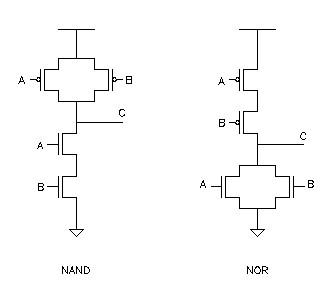

- AND, OR은 NAND와 NOR 회로 출력에 트랜지스터를 덧붙여 output을 반전시켜야 한다. (따라서 속도도 더 느리며, 전력도 더 많이 소모된다.)

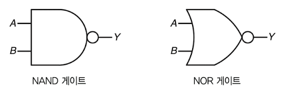

이런 특성 때문에 AND와 OR에 ○를 붙여서 위처럼 기호를 표현한다. 또한 이들은 AND나 OR보다 표현할 수 있는 논리가 더 다양하다.

> 논리로는 NAND를 $\lnot(x \land y)$ , NOR를 $\lnot(x \lor y)$ 로 표현하기도 한다. 집합으로는 각각 $(A \cap B)^C$ , $(A \cup B)^C$ 로 표현할 수 있다.

- NAND와 NOR은 **같은 input을 두 개 받아서 inverter**로 만들 수 있다.

   - a NAND a, a NOR a는 NOT a와 같다.

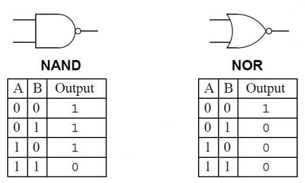

또한 드모르간의 법칙에 따라 inverter와 NAND 또는 NOR의 조합으로, AND와 OR 게이트를 표현할 수 있다.

- 모두 output에 인버터를 달면 각각 AND와 OR 게이트가 만들어 진다.

- NAND $\lnot(x \land y) = \lnot x \lor \lnot y$ : 두 input이 들어가는 부분에 각각 인버터를 달아주면 OR 게이트, 즉 $x \lor y$ 로 만들 수 있다. 

- NOR $\lnot(x \lor y) = \lnot x \land \lnot y$ : 두 input이 들어가는 부분에 각각 인버터를 달아주면 AND 게이트, 즉 $x \land y$ 로 만들 수 있다. 

> NAND와 NOR 모두 inverter로 만들 수 있었으므로, 결국 이 모든 논리를 NAND와 NOR로 표현한 것이다.

---

## 2.4 신호의 glitch와 hysteresis

앞서 distortion을 이용해서 아날로그 신호를 디지털 신호로 변환한다고 설명했다. 하지만 현실에서는 신호의 변환이 빠르게 진행되지 못하면서, noise(잡음)에 의해 threshold를 여러 번 오락가락할 수 있다.

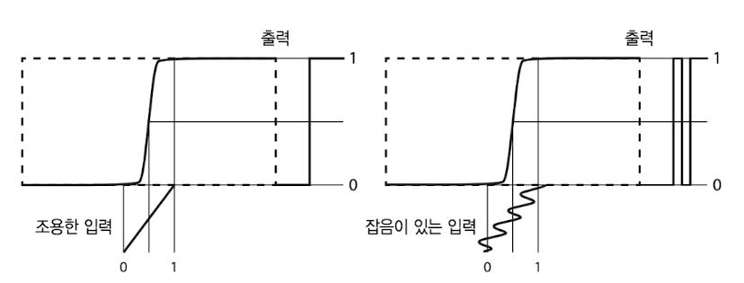

그림의 왼쪽은 noise가 없는 신호, 우측은 noise가 있는 신호다. 신호가 천천히 변하면서 noise에 의해 threshold를 여러 번 오가고 있다. 이 때문에 **glitch**가 생긴다.

이런 glitch를 **hysteresis**(이력 현상)으로 방지할 수 있다. 신호의 상태 변화에 따라 다른 threshold를 사용하는 것이다.

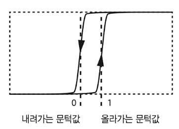

위 예시 그림은 올라가는 신호(0 to 1)와 내려가는 신호(1 to 0)이 서로 다른 transfer function을 쓰고 있다.

이에 따라 한번 threshold를 넘어가면, 다시 반전시키기 위해 더 많은 변화가 필요하게 된다. 즉, noise에 내성이 생기게 된다.

> 참고로 이 hysteresis를 사용하는 게이트가 있다. Schmitt trigger(슈미트 트리거)인데, 일반적인 게이트보다 더 복잡하고 비싸기 때문에 꼭 필요한 경우에만 사용한다.

참고로 0 to 1에서의 threshold를 **positive-going threshold**라고 하고, 1 to 0을 **negative-going threshold**라고 한다.

---

## 2.4.1 differential signalling

하지만 이런 hysteresis로도 threshold를 넘나드는 noise가 너무 많아 방지하기 힘든 경우가 있다. 이 때 전송선로를 2개로 만들어서, 서로 반대(**complementary**)로 흐르는 신호를 함께 이용하는 **differential signalling**(차동 신호) 방법을 적용할 수 있다.

> 벨이 발명한 twisted-pair cabling(연선 케이블링)도 노면전차가 만들어 내는 noise의 영향을 줄이기 위해, differential signalling을 적용한 것이다. 한 쌍의 선을 서로 꼬아서 만들었다.

> 현실에서도 USB, Ethernet 케이블(랜선), SATA(디스크 드라이브 인터페이스), HDMI, SD카드 방식인 UHS-II 등 다양한 곳에서 적용한다.(주로 고속 통신에 이용) 

서로 complementary한 신호가 흐를 때도, 전자기적 간섭은 두 선에 모두 비슷하게 noise를 발생시키므로, 이 두 신호의 차이값을 구하면 noise를 상당 부분 제거할 수 있다.

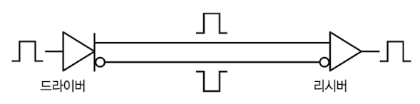

위 그림은 input을 complementary outputs으로 변환하는 **driver**(드라이버)와 이런 두 신호를 받아서 다시 단일 신호로 만들어 주는 **receiver**(리시버)를 표현한 것이다.

> driver는 내부에서 Differential amplifier(차동 증폭기)를 이용해서 complementary한 신호를 만들어낼 수 있다.

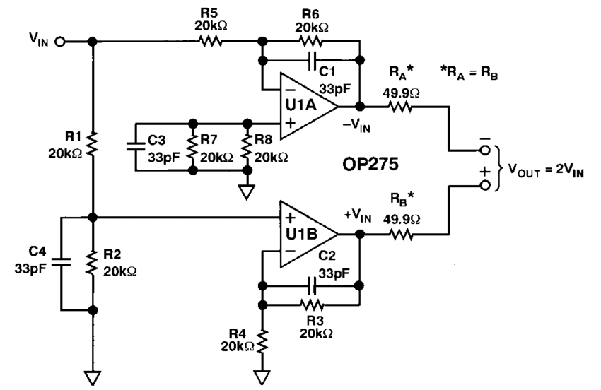

아래 사진은 연선 이더넷 케이블이다.

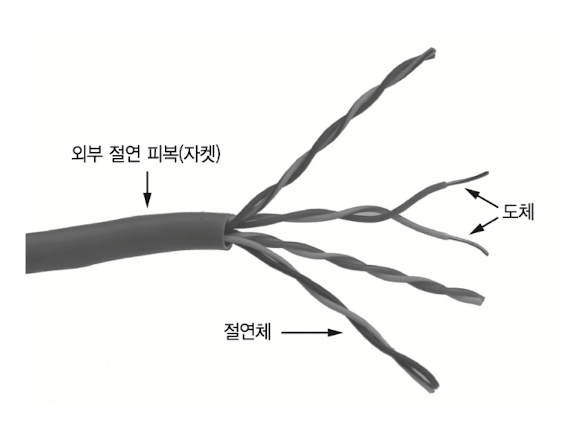

---