# 3 메모리와 디스크의 핵심: 순차 논리

컴퓨터는 어떻게 현재 처리 중인 수를 기억하면서 계산을 처리할까? 이 원리를 알기 위해서는 sequential logic(순차 논리)를 살펴 보아야 한다.

사람은 하루를 86,300초, 즉 지구 자전의 1/86,400이라는 periodic function으로 정의해서 시간을 측정한다.

컴퓨터 역시 이런 주기적인 전기 신호가 필요하다. 우선 inverter를 이용한 방법을 살펴보자

---

## 3.1 oscillator

inverter의 output을 다시 input에 연결하면 신호는 계속해서 complementary한 신호로 변할 것이다.

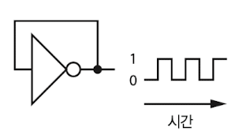

이런 장치를 **oscillator**(발진자)라고 하며, 이런 연결을 **feedback**(되먹임)이라고 한다. 이렇게 output은 0과 1을 oscillate(진동)한다.

이 값이 진동하는 속도는 propagation delay(전파 지연)에 따라 결정된다. 따라서 특히 온도가 영향을 줄 수 있기 때문에 주로 이를 방지할 수 있으면서 저렴한 crystal을 사용한다.(아래는 crystal의 schematic 기호이다.)

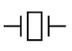

여기서 핵심이 되는 것이 **Piezoelectricity**(압전) 효과이다. 기계적 자극으로 일그러지면서 특정 압전 소자에 분극 효과가 발생하고, 분극 효과에 의해 순간적으로 전압이 발생하며 전류가 흐르게 된다.

> 피에르 퀴리 형제가 이 효과를 발견해서 Piezoelectricity라는 이름이 붙었다.

> 압전 소자에 인공 세라믹 재질을 많이 사용하면서 종종 압전 세라믹이라고도 부른다.

electrode(전극)을 crystal에 연결하고, 전류가 흐르면서 crystal이 구부러진다. 이런 자극에 crystal이 전기를 다시 만들어내는 시간은 매우 정확하기 때문에, 이를 응용해서 oscillator로 사용하는 것이다.

> 여러 발음체나 microphone(마이크)도 이런 piezoelectricity 효과를 이용한다. 이 경우에는 crystal에 전기 신호를 고압으로 입력해서 생기는 진동을 사용한다.

---

## 3.1.2 clock

여러 응용 프로그램에서 시간을 정확히 알 필요가 있지만, low level에서도 시간이 중요한 이유가 있다. 가령 시간을 알 수 있으면, 정해둔 시간만큼 adder의 지연을 기다릴 수 있다.

> 사용자보다 전자적/기계적 부품에 가까울 수록 low level(저수준)이라고 한다. 가령 트랜지스터는 트랜지스터로 구성된 게이트보다 low level이며, 이런 게이트나 여러 논리 회로로 조합해 만든 CPU는 트랜지스터보다 더 high level이다.

oscillator는 컴퓨터에 clock(시간을 셀 수 있게 해주는 신호)을 제공한다. 이에 따라 회로의 pace가 결정되며, 최대 clock 속도나 가장 빠른 tempo는 회로의 전파 지연 시간에 따라 결정한다.

그런데 부품들 사이에서도 지연 시간의 차이가 있다. 그래서 **binning**(부품의 특성에 따라 분류하는 과정)이 필요한데, 지연 시간이 짧은 부품과 긴 부품을 다른 bin으로 분류한다.

> 회로에서 종종 들을 수 있는 **overclocking**(오버클로킹)이란, 통계적으로 bin의 중간 정도에 위치하는 부품을 고장나지 않을 범위 안에서 clock을 빠르게 공급하는 도박을 한다는 뜻이다.

---

## 3.2 latch

주기적인 신호를 oscillator로 만든다면, 그 정보는 어떻게 기억할까? OR 게이트의 output을 input으로 다시 주는 feedback을 사용하면 기억할 수 있다.

> 기본적으로 아래는 1bit 메모리를 기억하는 방법이다.

- OR gate latch

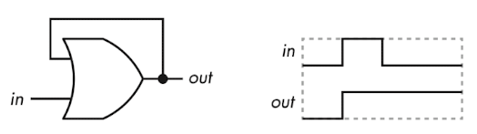

우선 OR 게이트의 feedback 구조를 보자. input 신호가 0 to 1이 되는 순간 output은 0에서 1로 바뀌며 상태를 유지하게 된다. 즉, 신호가 변했다는 것을 기억하게 된다.

하지만 이 회로만으로는 output을 다시 0으로 만들 수 없다. 아래는 feedback을 끊고 reset할 방법을 추가한 구조다.

 

- AND-OR gate latch

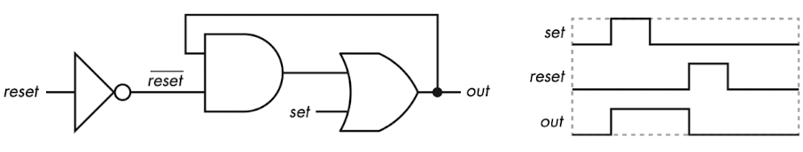

- inverter의 output $\overline{reset}$ : bar는 **opposite**을 의미한다.(리셋 바로 읽는다)

  - 즉, 0이면 1, 1이면 0이 된다. 이러한 성질 때문에 true를 표현하기 위해 오히려 0을 사용한다는 점에서 **active low**(액티브 로우)라고 부르기도 한다. (반대는 active high)

  - 값을 기억하고 있기 위해서는 $\overline{reset}$ 는 1을 유지하고 있어야 한다.

- $\overline{reset}$ 은 AND 게이트와 이어진다. 만약 $\overline{reset}$ 가 0(reset=1)이 되면, 1로 기억하고 있던 out이 다시 0으로 reset된다.

 

- S-R latch

S-R(set-reset) latch는 NAND 게이트를 이용한 방법이다. 이 구조는 $Q$ 와 $\overline{Q}$ 로 서로 complementary한 output을 내놓는다.

> NOR를 쓰면 input이 active high한 latch를 만들 수 있다. 그러나 이 설게는 더 전력을 많이 사용하고 복잡하며 비용도 더 소모하게 된다.

> NAND는 무조건 모든 input이 1이 되지 않는 이상 output이 1이라는 점을 기억하자.

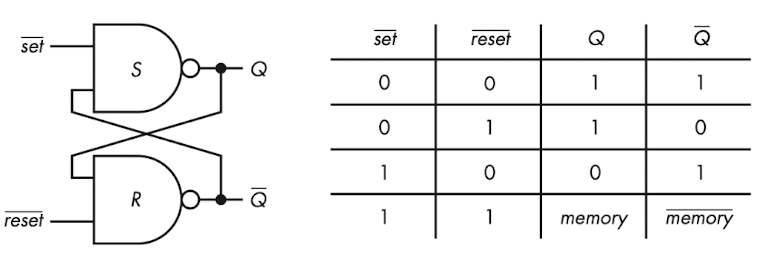

- $\overline{set}$ , $\overline{reset}$ 의 **초깃값은 알 수 없다**. (온도나 습도에 따라서도 달라지기 때문에 알 수 없다.) 따라서 초깃값을 상정한 계산은 불가능하며, <U>로직을 한 차례 재설정</U>하는 과정을 거쳐야 한다.

  - 예를 들어 $\overline{set}$ 를 0, $\overline{reset}$ 를 1로 재설정하면, <U>초기 상태가 무엇이었든</U> $Q$ 와 $\overline{Q}$ 가 각각 1과 0이 된다.

- 주의할 점은 $\overline{set}$ 도 0, $\overline{reset}$ 도 0이면, 두 output이 complementary하지 않기 때문에(둘 다 1이 된다.) 사용하면 안 된다.

- 마찬가지로 동시에 low나 high로 바뀌는 경우도 전파 지연 시간에 따라 출력이 달라질 수 있어서 결과를 예측할 수 없게 된다.

> 회로 설계가 대칭적이기 때문에 지연 시간이 비슷하다는 장점도 갖는다.

---

## 3.2.1 gate가 있는 latch

- gated S-R latch

아래는 S-R latch에 gate 한 쌍을 추가한 Gated S-R latch 회로이다.

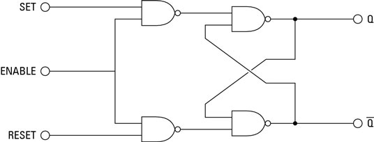

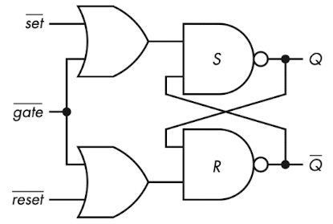

> (not A or not B) = A NAND B. 즉, 위 회로의 기능 자체는 동일하다. 아래 회로는 이미 complementary한 신호를 받은 경우일 뿐으로 해석에 주의. ENABLE = gate이다.

- $gate$ = 0 : $set$ 과 $reset$ 은 아무런 영향을 받지 않는다.

- $gate$ = 1 : $set$ 과 $reset$ 중 1인 값이 0으로 바뀌게 된다.(S-R latch에서 양쪽 다 1인 경우는 사용할 수 없었다.)

즉, $set$ 과 $reset$ 을 서로 complementary한 신호로 받아도, 둘 다 0이 되는 경우를 gate를 open하는 것으로 구현할 수 있는 셈이다.

즉, inverter를 입력 쪽에 추가하면, 1 bit 입력 $D$ 하나만을 받아서 회로를 구성할 수 있다.

 

- gated D latch

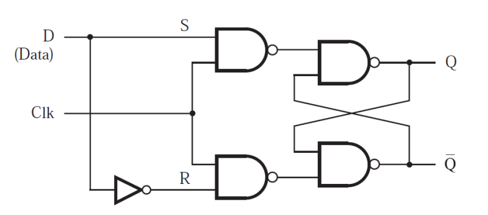

> Clk = gate

- gate가 1일 때는 0이 1, 1이 0으로 바뀌게 된다. 즉 $\overline{S}$ , $\overline{R}$ 이 된다.

- 반면 gate가 0이라면 두 $S$ , $R$ 값이 모두 1이 된다. 이 경우 $memory$ 와 $\overline{memory}$ 가 서로 반전된다.

> 앞서 재설정 과정을 적용하려면, $D$ 를 1, $gate$ 를 1로 설정하면 된다. 이 경우 $Q$ 와 $\overline{Q}$ 가 각각 1과 0이 된다.

> 위에서 $D$ 가 0이었다면 $Q$ 와 $\overline{Q}$ 는 각각 0과 1로 설정된다. S-R latch가 대칭 구조라는 점을 생각하자.

아래는 회로의 타이밍 다이어그램이다.

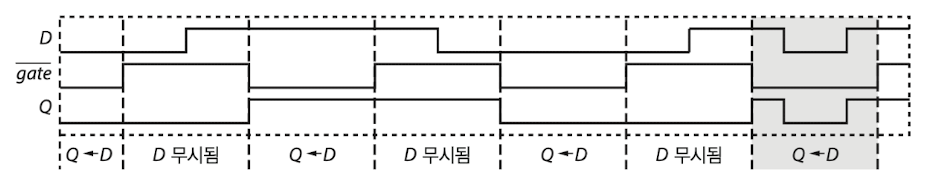

> Q가 바뀌는 구간을 유심히 살펴보자.

- gate = 1( $\overline{gate}$ = 0 ) : $D$ 의 변화에 따라 <U>신호가 바뀌게 된다.</U> 

- gate = 0( $\overline{gate}$ = 1 ) : $D$ 의 변화와 관계 없이 $memory$ 와 $\overline{memory}$ 만 한 차례 반전된다.

이를 다르게 생각해서 짧은 시간에만 $D$ 에 의해 생기는 변화를 조절하면, 좀 더 정확하게 신호를 조정할 수 있을 것이다.

---

## 3.2.2 flip-flop

앞서 언급한 것처럼 정확한 시간에 순간적으로만 변화가 생기도록 만들면 잘못된 결과가 생길 가능성을 최소화할 수 있을 것이다. 이처럼 level이 변화할 때 데이터를 catch하는 것을 **edge**(에지)라고 부른다.

이런 edge에 의해 데이터 변화를 만들어내는 latch가 있다. 3개의 S-R latch를 연결해서 만들 수 있는 D filp-flop부터 살펴보자.

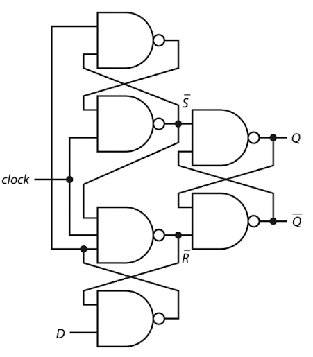

- $Q$ 와 $\overline{Q}$ 가 서로 complementary한 output이다.

이 D flip-flop은 <U>0 to 1로 바뀌는 순간</U>에 변화가 생긴다. 이를 **positive edge-triggered** flip-flop이라고 한다.(반대는 1 to 0일 때 변화가 생기는 negative edge-triggered이다.)

회로의 동작을 이해하기 위해 아래 그림을 살펴보자. 그림 다섯 개를 각각 설명할 것이다.

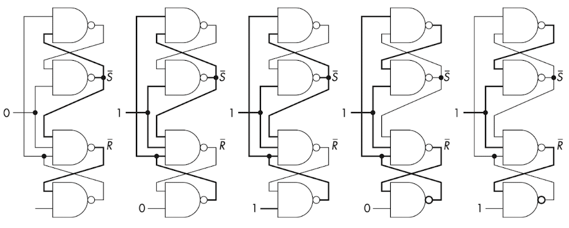

> 가는 선 : 0, 굵은 선 : 1 을 memory하고 있음을 나타낸다.

- 첫 번째 그림

  - clock = 0

  - $\overline{S}$ = 1

  - $\overline{R}$ = 1

NAND는 모든 input이 1이어야 0으로 바뀌므로 변화는 없다. 즉, clock = 0일 때는 D가 무슨 값이어도 결과는 바뀌지 않는다. 

무조건 $\overline{S}$ , $\overline{R}$ 은 1로 고정된다.

- 두 번째, 세 번째 그림

  - clock = 1

  - D = 0 / 1

  - $\overline{S}$ = 1

  - $\overline{R}$ = 0

(clock = 1) $\overline{R}$ 에 0이 저장되어 있으므로, 이 상태에서는 D가 무슨 값이어도 무조건 1로 바뀌게 된다.

이때 $\overline{R}$ = 0을 바꾸려면 clock=0으로 조절해야 가능하다.

- 네 번째, 다섯 번째 그림

  - clock = 1

  - D = 0 / 1

  - $\overline{S}$ = 0

  - $\overline{R}$ = 1

(clock = 1) $\overline{S}$ 에 저장된 값이 0일 때는 무조건 $\overline{R}$ = 1이 된다. 

그런데 clock이 0으로 바뀌기 전까지 $\overline{S}$ = 0으로 바뀌지 않기 때문에, 결과적으로는 $D$ 값을 바꿔도 아무런 의미가 없다.

 

즉, 위 조건들에서는 clock이 변화해야만 내부에 저장된 값들이 바뀌면서 $D$ 값에 따라 조절할 수 있는 것이다.

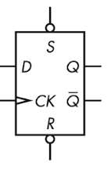

> S, R input에 ○가 붙어 있는 점에 유의하자. 이는 $\overline{S}$ , $\overline{R}$ 에 해당한다. 따라서 S-R latch와 같다.

위는 1918년 나온 7474라 불리는 D 플립플롭의 schematic 기호다.

edge에 의해 상태 변화가 촉발되는 장치에서는 전파 지연 외 요소도 고려해야 한다.

- $t_{setup}$ : **setup time**(설정 시간)은 clock edge가 '발생하기 전'에 얼마나 input이 안정적으로 유지돼야 하는지를 나타낸다.

- $t_{hold}$ : **hold time**(유지 시간)은 clock edge가 '발생한 후' 얼마나 input이 안정적으로 유지돼야 하는지를 나타낸다.

다시 말해 clock edge가 전후로 setup time+hold time 동안 input이 안정적이여야만 올바른 출력으로 보는 것이다.

---

## 3.3 counter

flip-flop을 응용해서 1,2,3 순서대로 수를 세는 counter(카운터)를 만들 수 있다. 수를 세려면 oscillator에서 나온 시간을 세서 decoder로 공급하는 역할을 하면 된다.

아래는 3bit ripple counter(리플 카운터)다. signal이 0에서 1로 가는 숫자를 세서 3비트 수( $C_2, C_1, C_0$ 를 만들어 낸다.

> 왼쪽에서 오른쪽으로 ripple(물결)이 퍼져나가듯 개수를 세기 때문에 이런 이름이 붙었다. $C_0$ 은 $C_1$ 을 바꾸고, $C_1$ 은 $C_2$ 를 바꾸는 식으로 과정을 반복한다.

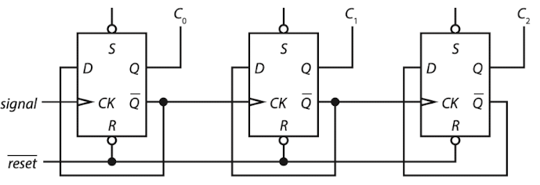

- $\overline{reset}$ 신호를 사용하면 counter를 0으로 reset할 수 있다.

- 출력 $\overline{Q}$ 가 자신의 input $D$ 와 연결되어 있다.

각 bit가 다른 bit의 상태 변화 이후 약간의 시차를 두고 바뀌기 때문에, 이 회로를 **asynchronous counter**(비동기 카운터)라고 부른다.

> 이런 성질 때문에 언제 결과를 살펴봐야 할지 알기 어렵다는 단점이 있다. 또한 오랜 시간이 걸리게 된다. 때때로 전파 지연에 따라 출력이 틀리기까지 한다.

이런 asynchronous counter의 문제를 해결할 수 있는 counter로, **synchronous counter**(동기 카운터)가 있다. 아래는 3bit asynchronous counter다.

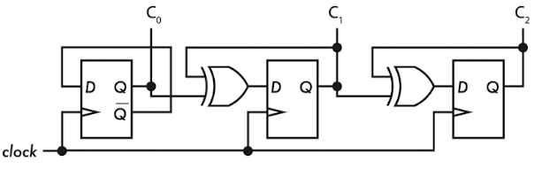

이 counter는 모든 flip-flop에 같은 clock이 들어간다. 따라서 상태가 모두 동시에 변하게 된다.

정확한 출력 생성 시점을 알기 위해서는 여전히 전파 지연은 고려해야 하지만, filp-flop 연결로 생긴 시차를 고려하지 않아도 된다.

counter도 하나의 schematic 기호로 표현할 수 있다. 종류에 따라 일부만 제공할 수도 있다.

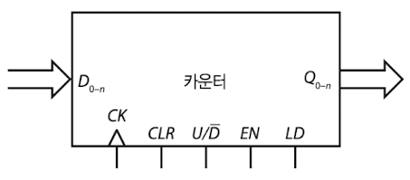

- CLR : reset, 즉 counter를 0으로 되돌린다.

- EN : counter를 활성화한다.(true일 때만 counter가 활성화)

- $U/\overline{D}$ : counter가 개수를 증가시킬지(1), 감소시킬지(0)를 결정한다.

- LD : counter를 input에서 지정한 값으로 설정한다.

---

## 3.4 register

값을 쉽게 기억하는 D flip-flop을 한 패키지에 넣은 register 회로가 있다.

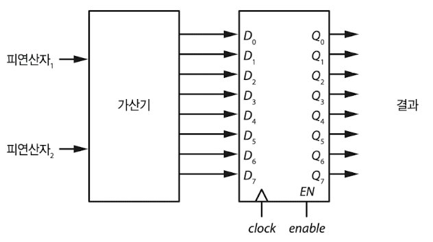

---

## 3.5 메모리 조직과 주소 지정

register를 이용해서 쉽게 여러 bit를 저장할 수 있게 되었다. 그렇지만 훨씬 더 많은 정보를 저장해야 한다면 어떻게 해야 할까? 우선 레지스터를 많이 쌓아야 한다.

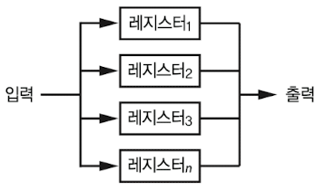

하지만 이렇게 쌓으면 어떤 register를 사용해야 할지 막막하다. 따라서 각 register마다 번호를 부여한다. decoder와 함께 사용하는 것으로 이런 처리가 가능하며, 이 번호를 **address**(주소)라고 부른다.

또한 지정한 address에 해당하는 output은 selector(선택기)를 사용해서 얻을 수 있다.

이렇게 구성한 메모리 컴포넌트의 output들을 한 output으로 연결해야 할 수도 있다. 이런 경우 **tri-state**라는 또 다른 기본 요소가 필요하다.

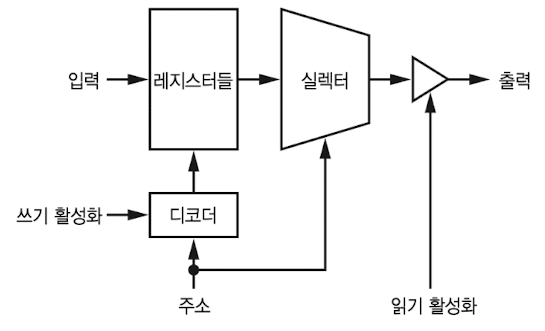

이런 메모리 컴포넌트는 연결 지점이 굉장히 많다. 32bit 수를 다루고 싶다면 input과 output을 32개씩 연결해야 하며, address, 제어 신호, 전원도 연결해야 한다.

> input과 output data 연결을 합치고, $read/\overline{write}$ 제어 신호를 사용하면서 연결을 많이 줄일 수 있다.

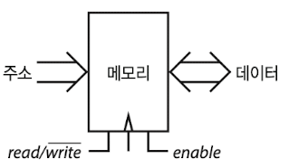

위에서 address와 data는 큰 화살표로 표시했는데, 이런 식으로 연관된 신호를 **bus**(버스)라고 부른다. 즉, address bus, data bus가 있는 것이다.

---

### 3.5.1 addressing

메모리 크기가 늘어날 수록 address로 연결해야 하는 bit 수도 늘어난다. 따라서 교통 관리 문제와 같이 정리가 필요한데, 메모리 칩 내부 address를 row, column으로 구성된 격자처럼 관리한다.

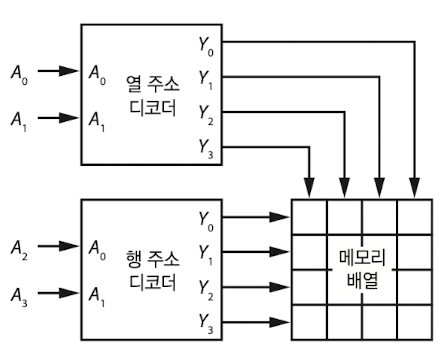

row를 담당하는 decoder, column을 담당하는 decoder를 조합해 address를 지정한다. 위 그림은 address가 16개밖에 존재하지 않지만, 이보다 더 많은 메모리가 존재하면 효율적인 방법이 필요하게 된다.

아래는 row, column address를 **multiplexing**(멀티플렉싱)한 것이다. 이 방법을 적용하면 address line의 수를 반으로 줄일 수 있다. register는 multiplexing한 주소를 저장한다.

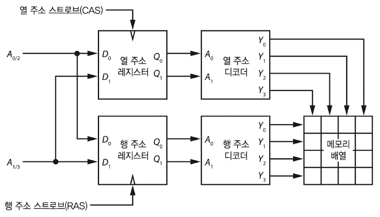

위 그림에서는 주소가 두 부분으로 나뉘어 들어오게 된다. row를 먼저 지정한 뒤 column 주소만 변화시키는 방식으로 좀 더 빠르게 처리할 수도 있다.(오늘날 메모리 칩은 이런 식으로 처리한다.)

> depth * width로 크기를 표현할 수 있다. 예를 들어 256 $\times$ 8 칩은 row가 8, column이 256인 메모리 지점을 제공한다. 

---

## 3.6 RAM(Random Access Memory)

지금까지 살펴본 memory를 바로 **RAM**(Random Access Memory, 임의 접근 메모리)라고 한다. address에 따라 원하는 곳은 어디든지 원하는 순서에 따라 쓸 수 있었다.

RAM은 크게 두 가지로 나눌 수 있다.

1. SRAM(static RAM)

**SRAM**(정적 RAM)은 비싸지만 매우 빠르다. 각 bit에 트랜지스터가 6개씩 들어간다. 이 때문에 공간을 차지하므로 굉장히 많은 bit(수십억~수조)를 저장하기 위해 쓰기는 어렵다.

2. DRAM(dynamic RAM)

**DRAM**(동적 RAM)은 capacitor와 트랜지스터 1개만을 사용한다. 하지만 capacitor 특성상 주기적으로 **refresh**를 해야 한다는 단점이 있다. 또한 refresh 시점과, 정보를 write하는 시점이 겹치면 안 된다.

집적도를 높게 구성할 수 있기 때문에, address가 많은 큰 메모리칩에 사용한다.(따라서 multiplexing도 사용한다.)

> 여러 요인으로 인해 row address를 저장하는 속도가 column address를 변경하는 속도보다 더 빠르다.

SRAM과 DRAM 모두 **volatile**(휘발성) memory이다. 전원이 (잠깐 혹은 완전히) 끊기면 data가 모두 사라지게 된다.

> non-volatile RAM으로 **core** memory가 있는데, bit를 토러스 모양(toroidal, 도넛 모양)의 쇳조각에 저장한다. 오래된 기술이지만, non-valatile한 성질 때문에 장점을 살리려는 연구가 지속되고 있다.

---

## 3.7 ROM(Read-Only Memory)

**ROM**(Read-Only Memory, 읽기 전용 메모리)는 사실 그리 정확한 이름은 아니다. 한 번만 쓸 수 있는 메모리(write-once memory) 정도가 더 정확할 것이다. 이 말대로 한 번 쓰고 나면 data를 (반)영구적으로 여러 차례 읽을 수 있다. 

> 전자레인지처럼 가전제품의 소프트웨어를 한 차례 내장하고 읽기만 하는 식으로 ROM을 사용하기도 한다.(ROM에 담긴 소프트웨어를 펌웨어라고 했다. 지금은 ROM에 담기지 않아도 펌웨어라고 지칭하는 경우가 많다.)

> 컴퓨터의 BIOS도 ROM에 담기며, 게임 패키지와 같이 정보의 무결성이 무조건적으로 보장되어야 하는 기록물에도 쓰인다. 예전 게임 패키지를 롬 파일이라고 부른 이유이다.

삭제나 수정이 가능한 ROM도 있으나 대부분은 오래 걸리거나 비싼 단점을 가지고 있다.

---

## 3.8 block device

**mass storage**(대형 저장장치)로 알려진 **disk drive**(디스크 드라이브)는 굉장히 많은 데이터를 저장하기 알맞다. 자화된 platter에 bit를 저장하며, platter가 돌아가면서 데이터가 저장된 위치에 도달하면 disk head가 데이터를 읽는다.

> 하드 디스크라고 부르기도 한다.

하지만 이런 원리 때문에 방금 헤드가 데이터를 지나쳤다면, 회전판이 거의 1바퀴를 돌 때까지 기다려야 한다.(거의 8밀리초) 게다가 기계 부품이 오염이나 마모에 취약하다.

> 이런 점 때문에 기록 밀도와 속도를 맞바꾼 기억 장치로 볼 수 있다.

대신 memory와 같은 address나 연결을 위한 공간이 필요 없다. **block** 단위(**sector**)로 address를 지정해서 읽는다.

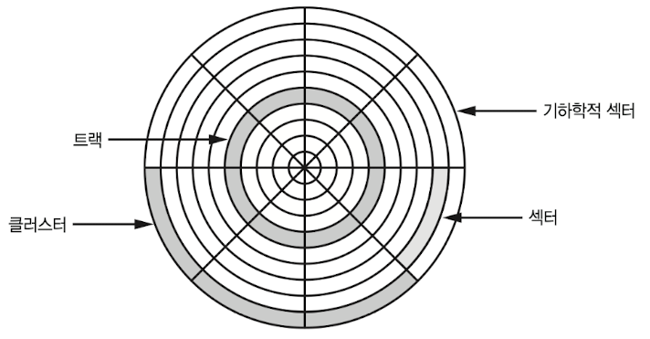

원래는 sector당 512 byte를 저장했으나, 현재는 4,096 byte를 저장한다. 그러나 이 disk에서 한 byte만 바꾸고 싶어도, block 전체를 읽고 원하는 byte를 바꾼 뒤 block을 아예 다시 써야 한다.

모든 sector마다 bit 수가 같으므로, $mm^2$ 당 bit 수(bit density)는 안쪽이 더 높다. 따라서 최근에는 외부 영역에 더 많은 sector를 넣는 방식으로 이 문제를 해결하고 있다.

> CD, DVD 같은 optical disk(광학 디스크)는 자성 대신 빛을 이용해서 데이터를 저장한다. 대량으로 찍어낼 수 있는 장점이 있다.

---

## 3.9 flash memory

**flash memory**(플래시 메모리)는 최근 나타난 EEPROM(전기로 지울 수 있는 ROM) 유형 매체이다. ROM이지만 MOSFET에 floating gate를 추가한 구조로 RAM과 유사한 측면도 있다.

> ROM에서 나왔고 비슷한 측면이 있지만, 하드 디스크의 sector와 같은 page 단위로 접근한다는 특성 때문에 보조 기억 장치로 분류된다.

원하는 address를 마음대로 읽을 수 있지만, 빈 flash memory에 데이터를 기록하기 위해서는 먼저 0을 채워 넣어야 한다. 또한 0을 1로 바꿀 수는 있지만, 전체를 지우지 않고 원하는 비트만 0으로 바꿀 수는 없다.

이런 낭비를 줄이기 위해서 flash memory는 블록 단위로 나뉘게 되며, 값을 블록 단위로 지우고 쓰게 된다.

> 읽을 때는 **random access**(임의 접근) 장치, 쓸 때는 **block access** 장치인 것이다.

이런 flash memory를 disk drive 모양의 패키지에 넣는 것이 **SSD**(solid-state drive)이다.

> flash memory는 여러 번 쓰고 지우는 수명이 존재하기 때문에, SSD에서는 모든 블록이 가능하면 똑같은 수준으로 낡도록 조정하는 프로세서가 들어 있다.

---

## 3.10 오류 감지와 정정

데이터 오류는 종종 발생한다. 가령 우주 방사선이 memory에 닿아서 bit가 잘못될 수도 있다. 이럴 때 어떻게 오류를 알 수 있을까?

단순히 복사본 하나를 만드는 방법으로는 어떤 데이터가 문제가 생겼을 때, 어느 쪽이 정답인지 알 수 없어서 문제를 해결할 수 없다. 따라서 3벌을 만드는 방식도 가능하지만, 이는 아주 혹독한 환경이 아니면 실행하는 방식이 아니다.(우주선에서는 이런 방식을 쓴다.)

- parity

**parity**(패리티)를 사용하면 단 1bit만 데이터가 잘못되어도 문제를 감지할 수 있다. 데이터에서 1로 설정된 bit의 수를 센 뒤, 그 개수가 짝수인지 홀수인지를 나타내는 1bit를 데이터에 덧붙이는 방법이다.

> 모든 데이터에 XOR을 취하면 쉽게 알 수 있다.

**even parity**(짝수 패리티)는 모든 bit를 서로 XOR한 값을 사용하며, **odd parity**(홀수 패리티)는 이 값의 complement를 사용한다.

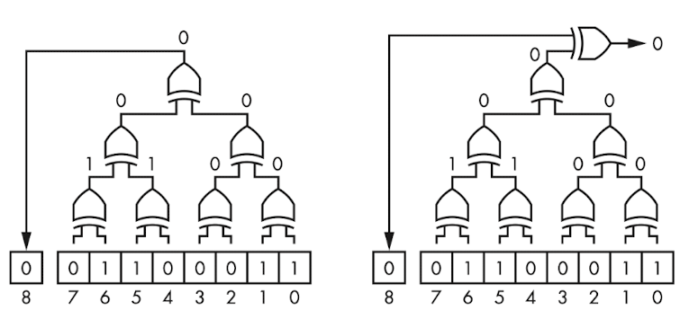

위 그림 중 왼쪽은 even parity 검사를 시행한 그림이다. 오른쪽은 parity 검사를 나타낸다.

> 그러나 오류가 짝수 번 일어나서 문제를 인식하지 못할 수 있다. 정적인 데이터보다 주로 끊임없이 변하는 데이터를 처리할 때 사용한다.

- checksum, CRC

정적인 데이터에서는 더 값싼 방법으로 검사할 수 있다. 단순한 방법으로 **checksum**, **CRC**(cyclic redundancy check, 순환 중복 검사) 등이 있다.

---