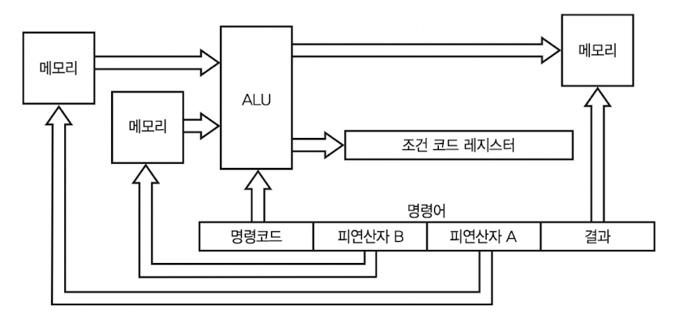
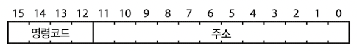

# 4 컴퓨터 내부 구조

현대의 컴퓨터는 크게 memory(기억 장치), I/O(Input and Output, 입력과 출력), CPU(cental processing unit, 중앙 처리 장치)으로 나뉜다.

---

## 4.1 memory 거리

memory는 집이 빈틈없이 늘어선 거리와 같다. 모든 집은 숫자로 된 address가 있다. 

만약 메모리 크기가 64MiB(메비바이트, 저장 장치의 단위)라면, 전체는 64 $\times$ 1,024 $\times$ 1,024 = 67,108,864 byte이다. 이 경우 각 byte는 0부터 67,108,863까지의 address를 갖는다.

> 구체적인 address에 위치한 memory를 가리킬 때 memory location(메모리 위치)라는 말을 사용한다.

그런데 memory의 기본 단위가 byte라고 해서, 꼭 data를 1byte 단위로만 읽어야 한다는 뜻은 아니다. 예를 들어 32bit 컴퓨터는 보통 4byte씩, 64bit 컴퓨터는 8byte씩 memory를 구성한다.

> 이런 단위가 클수록 data bus에 더 많은 data를 실을 수 있다.(즉, 더 많은 데이터를 처리할 수 있다.)

이 경우 데이터 덩어리 단위로 address를 지정할 수 있으며, 이 덩어리 안에서도 작은 덩어리로 쪼개서 address를 부여할 수 있다.

이렇게 하면 각 byte마다 다른 차선을 배정받을 수 있다. 하지만 위 그림 속 (1-2-)5,(1-3-)6,(1-3-)7,(2-4-)8을 한 덩어리로 데려올 수는 없다. 1번 집을 왕복한 뒤 2번 집을 들리는 방식으로만 가능하다.

> 이런 식으로 한 번에 두 건물에 걸친 데이터를 읽는 경우를 **nonaligned access**(정렬이 맞지 않는 접근)이라고 한다.

또한 bus에 맨 앞에 어느 byte를 넣는가에 따라 두 가지 방식(endian)이 있다.

---

## 4.2 I/O device

컴퓨터의 **peripheral device**(주변장치) 중 하나인 **I/O device**는 정보를 밖으로 전달하거나 밖에서 가져온다.

원래 memory bus 경로와 I/O device bus 경로는 분리되어 있었지만, 현재는 memory address가 굉장히 많아지고 이에 따라 빈 address도 많아졌다. 따라서 빈 부분 중 일부를 I/O device에 할당하면서 같은 bus를 쓰게 됐다.

이런 할당에는 설계상 표준 I/O slot이 있어서, 각 slot을 차지한 장치는 자신에게 할당된 address를 모두 사용할 수 있다. 또한 각 slot에는 어떤 장치가 연결됐는지 파악할 수 있게 해주는 특별 address도 가지고 있다.

---

## 4.3 CPU

**CPU**(Central Processing Unit, 중앙 처리 장치)는 실제 계산을 처리하는 컴퓨터 부품이다. 다양한 요소로 구성되어 있다.

> 위 그림들에서 CPU가 바로 도심에 해당하는 부품이다.

---

### 4.3.1 ALU

우선 핵심 부품으로 **ALU**(Arithmetic Logic Unit, 산술 논리 장치)가 있다. ALU는 산술 계산, boolean algebra 등 여러 연산을 수행한다.

- **operand** : 피연산자. 수를 표현하는 bit이다.

- operation code : **opcode**(연산 코드). ALU가 어떤 operator(연산자)를 적용할지 지정한다.

- result : 계산 결과

- condition code : 조건 코드. result와 관련된 추가 정보이다. 보통 **condition code register**(조건 코드 레지스터)에 이 condition code가 저장되게 된다.

> register는 memory 거리는 아니지만, 도심 속에 위치한 더 비싼 특별한 memory(집)인 셈이다.

아래는 condition code register를 표현한 그림이다.

- bit number를 모두 사용하지 않는다는 점에 유의해야 한다.

- N bit: 음수라면 1로 설정

- Z bit: 마지막 연산 결과가 0이면 1로 설정

- O bit: overflow 혹은 underflow 발생 시 1로 설정

아래는 ALU opcode(명령 코드) 예시가 담긴 표다.

- shift

ALU는 shift 연산도 수행한다. 예를 들어 01101001( $105_{10}$ )을 왼쪽으로 1bit shift하면 11010010( $210_{10}$ )을 얻는다. (이 연산은 수에 2를 곱한 연산과 동일하다.)

오른쪽으로 shift할 수 있다. 이 경우 수에 2를 나누면서 나머지를 버리는 연산과 동일하다.

그런데 이때 사라지는 MSB 값이나 LSB 값을 알아야 할 때가 있는데, condition code register가 바로 이 값을 저장하게 된다. 

> shift를 제외한 위 예시 코드들은 조합 논리로 구현 가능하다.

- shift register

clock에 따라 내용을 1bit씩 shift하는 **shift register**을 flip-flop으로 구현할 수 있다.

다만 위 sequential shift register는 1bit shift마다 한 clock이 필요하기 때문에, 여러 bit를 shift하려면 많은 시간이 소요된다.

이런 문제는 selector와 조합 논리를 사용하는 **barrel shifter**(배럴 시프터)를 사용하면 해결할 수 있다.(8bit shifter를 만든다면 8:1 selector가 8개 필요하다.) 

아래는 8bit를 shift하는 barrel shifter 회로다.

- $S_{0}, S_{1}, S_{2}$ : 오른쪽으로 shift할 bit 수

  - shift하지 않는다면 000이 된다.

  - 001이면 오른쪽으로 1bit shift

  - 010이면 오른쪽으로 2bit shift

  - ...

- input bit $I_{0}$ 은 output bit $O_{0}$ 으로 연결된다. 이런 식으로 8 input bit가 output bit와 각각 연결된다.

> shifter는 floating point 구현에도 핵심 부품이다. 

---

### 4.3.2 execution unit

**execution unit**(실행 장치)는 **control unit**(제어 장치)로도 불리며, memory의 정해진 장소에서 <U>opcode와 operand를 가져와서 ALU에게 어떤 연산을 수행할지 알려준다.</U> 또한 그 결과를 다시 memory로 돌려주는 역할을 한다.

그러면 어떻게 이런 작업을 수행하는 것일까? 답은 실행 장치가 가지고 있는 **instruction**(명령어) 목록에 따라 execution unit이 수행하기 때문이다.

> 예를 들어 어느 명령어는 'address 10에 있는 수를, address 12에 있는 수와 더한 뒤, 결과를 address 14에 넣어라.' 같은 내용이다.

> instruction의 bit 패턴은 CPU마다 고유한 설계를 갖는다.(공통 표준이 없다.) 따라서 Intel와 ARM은 서로 다른 bit 패턴을 갖는다.

그렇다면 각 작업들을 어떻게 수행하는지 알아보자.

- instruction의 address 위치를 아는 법

execution unit은 instruction이 있는 address를 알기 위해 **program counter**(pc, 프로그램 카운터)를 사용한다. register의 일종이며, memory와 별도로 특별한 곳에 위치한다.

> 흔히 말하는 counter를 register 기능에 추가한 것이라 생각하면 된다.

program counter에는 memory address가 들어 있다. 즉, memory 위치를 **reference**(참조)한다. execution unit은 program counter가 가리키는 address에서 instruction을 읽어온다.

> 참고로 특정 instruction을 사용하면 program counter의 값을 바꿀 수 있다.

instruction을 수행한 뒤에는 다음 instruction을 memory의 다음 위치에 가져올 수 있도록, program counter가 **increment**(증가)한다.(instruction 크기가 program counter에 더해지게 된다.)

> CPU마다 정해진 초기 program counter 값(reset vector)이 있으며, CPU 전원이 들어오면 PC는 이 값으로 설정된다.

> 컴퓨터는 memory의 정해진 위치에서 어떤 일을 해야 하는지 적힌 쪽지를 찾는다. 이후 다른 장소로 이동해서 다음 쪽지를 찾는 식으로 작동한다. 이 과정을 반복하면서 프로그램을 실행한다.

---

#### 4.3.2.1 instruction 처리: 4가지 필드 구성

- **three-address instructions**

CPU가 16bit instruction을 사용한다고 가정하자. CP와 operand A, B, 결과를 16bit로 표현해야 할 것이다.

만약 다음과 같이 4가지 필드로 구성하면 어떨까? 3개 address를 가리킨다.

- opcode / destination address / source address / source address로 표현하기도 한다.

이렇게 나누면 실제로 잘 작동하지 않는다. 그 이유는 operand와 결과 address에 4bit밖에 할당되지 않기 때문이다. 

> 4bit로 address를 표현한다면, 결국 표현할 수 있는 address가 16개( $2^{4}$ )밖에 없다는 말과 같다. 그러면 쓸모 있는 memory 크기의 메모리를 가리키기 힘들 것이다.

만약 이런 식의 분할을 지속하면 64bit 크기의 instruction을 사용해도, 결국 20bit address 3개를 사용(4+20+20+20)할 것이다. 20bit로는 몇 MiB밖에 처리할 수 없다. 

> 최신 컴퓨터들은 GiB 이상 memory를 쓸 수 있다. 이와 비교하면 얼마나 비효율적인지 알 수 있다.

 

- **address extension register를 적용**

또 다른 접근 방법은, DRAM의 address 지정 기법을 도입하는 것이다.(정리 3.5.1절에서 address register를 이용한 것을 기억) **address extension register**(주소 확장 레지스터)를 두고 별도의 instruction을 사용해 상위 address를 지정한다.

> 상위 address란 MSB에 가까운 bit들을 뜻한다.

이런 접근 방법을 intel은 PAE(physical address extension, 물리 주소 확장)이라고 불렀다. 다만 address extension register에 값을 설정하기 위한 시간이 소요되며, memory 영역을 모두 여러 번 register를 설정해야 한다는 단점이 있다.

> three-address instructions이 잘 작동하지 않는 더 중요한 이유가 있다. 이 3가지 memory block이 각기 다른 장치에 존재하고, 따라서 address bus와 data bus가 3개씩 따로 존재하기 때문이다.

> 이런 낭비를 줄이기 위해서는 data bus와 address bus를 하나만 두고 memory 장치를 공유해야 한다.

이 three-address instructions으로 컴퓨터 구조를 만든다면 얼마나 비효율적인지 보자. 다음은 구조와 instruction을 처리하는 절차다.

1. <U>program counter</U>에 들어 있는 address를 사용해 <U>memory에서 instruction을 읽어온다.</U>

2. instruction의 operand A 부분에 있는 address를 이용해서, <U>memory에서 데이터를 읽고 address A register에 저장</U>한다.

3. instruction의 operand B 부분에 있는 address를 이용해서, <U>memory에서 데이터를 읽고 address B register에 저장</U>한다.

4. 연산 결과를 instruction <U>결과 부분에 있는 address에 해당하는 memory에 저장</U>한다.

위와 같은 과정으로 구성하고 instruction을 처리하면 회로가 너무 복잡해진다. 각 단계를 한 clock에 수행한다면, instruction을 처리하기 위해 4 clock이 필요하다. 

> 따라서 한번에 한 memory address에만 접근할 수 있다는 사실에 유의해서, instruction 집합을 적절히 설계해야 한다.

---

#### 4.3.2.2 accumulator 이용

**accumulator**(누산기)는 ALU가 계산한 중간 산술 결과를 저장하는 register이다.(A register라고 부르기도 한다.)

> 결과를 다시 주 기억장치에 기록하는 것보다, ALU로 직접 통하는 통로가 있는 accumulator 같은 register에 접근하는 것이 더 빠르다.

즉, 기존에는 두 memory address에 있는 값을 연산해서 나온 결과를 다른 memory에 넣는 과정이었다.(C=A+B) 하지만 accumulator를 이용하면 한 memory address에 있는 값과 accumulator에 있는 값을 연산하고, 이 결과를 accumulator에 넣는다.

> 물론 accumulator에 있는 값을 memory에 저장하기 위해 **store**(저장) 명령어를 추가해야 한다.

따라서 instruction을 1 address로 구성할 수 있다.

연산이 만약 C=A+B라면, accumulator을 이용했을 때 다음과 같은 과정을 따르게 된다.

1. accumulator = A

2. accumulator = accumulator + B

3. C = accumulator

이렇게 세 과정을 거치므로 instruction이 3개 필요하다. 사실상 한 instruction을 세 instruction으로 더 크게 만든 셈이라서 그다지 효율적으로 보이지 않을 수 있다.

하지만 이번엔 네 가지 주소가 연관된 연산을 보자. D = A + B + C라고 하면, three-address instruction으로도 한 번에 처리할 수 없다.

1. 중간 값 = A + B

2. D = 중간 값 + C

만약 12bit address를 사용했다면, address 3개와 opcode를 저장하기 위해 12*3 + 4 = 40bit instruction이 필요할 것이다. 게다가 이 과정을 두 번 거치므로 총 80bit가 소요된다.

이번에는 one-address instruction 연산을 보자

1. accumulator = A

2. accumulator = accumulator + B

3. accumulator = accumulator + C

4. D = accumulator

4번의 연산이 필요하지만, (12+4) * 4 = 64bit instuction만 있으면 해결된다. 

> 이렇게 accumulator를 이용해서 one-address instruction을 적용하면, 12bit를 한 address 지정에 쓸 수 있었다. 즉 $2^{12}=4096$ 가지 address를 가리킬 수 있는 것이다.

사실 이 정도로는 여전히 사용 가능한 address가 부족하다. 지금까지의 address를 직접 가리키는 방식을 **direct addressing**(직접 주소 지정)이라고 한다.

---

#### 4.3.2.3 instruction 처리: indirect addressing

**indirect addressing**(간접 주소 지정)을 사용하면 더 많은 memory를 사용할 수 있다. 

이 방식은 instruction에 있는 값을 operand address로 해석하지 않고, operand <U>값을 얻을 수 있는 memory address</U>를 가리킨다.

예를 들어 memory address 12에 4,321, memory address 4,321에는 345가 들어 있다고 가정하자.

- instruction은 operand을 12로 한다.

- direct addressing: load instruction은 4,321을 accumulator에 넣게 된다.

- indirect addressing: load instruction은 345를 accumulator에 넣게 된다.

이런 두 가지 direct/indirect addressing mode만으로도 memory를 다루기에는 충분하다. 하지만 변수 말고 때론 상수를 지정해야 할 필요도 있다.

이 경우 **immediate addressing mode**(즉시 주소 지정 모드)라는 direct addressing을 사용하면 된다. 이 경우에는 address에 해당하는 bit를 그냥 값으로 간주한다. 위 예시에 적용하면 다음과 같다.

- immediate addressing mode: load instruction은 12가 되어 accumulator에 들어간다.

> indirect addressing mode은 memory에 세 번 접근하게 된다.(한 번은 instruction, 두 번은 memory에서 data를 읽는다.) 따라서 나머지 둘보다 더 느리다.

---

### 4.3.3 opcode instruction

덧셈, 뺄셈, 비교 연산 등은 instruction code에 따라 condition code(조건 코드)가 설정되었다. 

하지만 이를 수행하기 위해서는 우선 condition code를 의도대로 설정하거나, 살펴보는 방법 또한 필요하다.

- cca: condition code register 값을 accumulator로 복사한다.

- acc : accumulator 값을 condition code register에 복사한다.

다양한 instruction을 수행할 수 있는 명령어가 있지만, 이를 모두 sequencial하게 진행하는 건 비효율적이다. 일부만을 선택적으로 실행할 수 있다면 더 효율적일 것이다.

이를 위해서 program counter 값을 변경할 수 있는 instruction이 필요하다. 이런 instruction을 **branch** instruction(분기 명령어)이라고 한다. 

> branch instruction만으로는 순서대로 일련의 instruction을 실행하는 것에 비해 그다지 유용하지는 않다.

condition code를 살피고, 어떤 condition을 만족할 때만 branch하는 instruction도 있다. (**conditional branch instruction**)

> <U>조건을 만족하지 않으면 pc가 평소와 마찬가지로 증가</U>한다.(즉, 다음 instruction이 실행된다.)

branch instruction에는 조건을 저장하기 위한 bit가 필요하다. 아래는 이를 정리한 표다.

때로는 program counter의 내용을 명시적으로 바꿀 필요가 있다. 이를 위한 두 가지 특별한 명령어가 있다.

- pca : 현재 program counter 값을 accumulator에 복사한다.

- apc : 현재 accumulator 값을 program counter에 복사한다.

> cca, acc, pca, apc 모두 앞에 있는 것을 뒤에 있는 것에 복사했다. A to B처럼 생각하자.

---

### 4.3.4 instruction set 구성 정리

위 기능들을 종합해서 instruction을 구성하면 다음과 같다.

- mode : operend를 정하기 위한 addressing mode 선택. mode 선택을 위해서는 2bit가 필요하다.

  - 앞서 언급한 3가지(direct, indirect, immediate) 외 나머지 하나는 memory와 관련 없는 연산을 표현한다.

- opcode : ALU가 어떤 연산을 수행할지 결정하는 operation code.

  > branch instruction이 opcode에 포함된다. 이 점에 주의하자.

- address

아래는 opcode와 addressing mode를 나타낸 표다.

여기서 mode:11에 opcode:0100, 0101에 해당하는, 왼쪽 shift(shl)와 오른쪽 shift를 살펴보자. 이때는 사용되지 않는 bit들을 사용해 shift할 bit 수를 나타낸다.

 

### &nbsp;&nbsp;&nbsp;📝 예제: 피보나치 수를 계산하는 프로그램&nbsp;&nbsp;&nbsp;

이제는 **program**을 작성해 실제 컴퓨터에게 어떤 일을 지시할 수 있다. program이란 어떤 목표를 달성하는 일련의 instruction들을 말한다. 

- 목표: 200보다 작은 모든 피보나치 수를 계산한다. (0, 1, 1, 2, 3, 5, 8, 13, ...)

순서도는 다음과 같다.

1. $a_{0} = 0$ 로 설정한다.

2. $a_{1} = 1$ 로 설정한다.

3. $a_{2} = a_{0} + a_{1}$ 로 연산한 뒤 값을 $a_{2}$ 로 저장한다.

4. $a_{1} \rightarrow a_{0}$ , $a_{2} \rightarrow a_{1}$ 로 설정한다.

5. $a_{2} < 200$ 이면 3번으로 돌아간다. 아니면 반복을 끝낸다.

### &nbsp;&nbsp;&nbsp;🔍 풀이&nbsp;&nbsp;&nbsp;

1. $a_{0} = 0$ 로 설정한다.

accumulator를 0으로 만들어야 한다. 즉, immediate로 load 0 명령을 하면 된다.

| address | instruction 전체 |
| --- | --- |
| 0000 | 10 0000 0000000000 |

- 10 : immediate

- 0000 : load

- 0000000000 : address. 0d으

그 다음 accumulator에 있는 값(0)을 memory address 100에 저장한다.

| address | instruction 전체 |
| --- | --- |
| 0001 | 00 0111 0001100100 |

- 00 : direct

- 0111 : store

- 0001100100 : address

2. $a_{1} = 1$ 로 설정한다.

accumulator에 1을 넣는다.

| address | instruction 전체 |
| --- | --- |
| 0010 | 10 0000 0000000001 |

- 10 : immediate

- 0000 : load

- 0000000001 : address. 1을 load

그 다음 accumulator에 있는 값(1)을 memory address 101에 저장한다.

| address | instruction 전체 |
| --- | --- |
| 0011 | 00 0111 0001100101 |

- 00 : direct

- 0111 : store

- 0001100101 : address

3. $a_{2} = a_{0} + a_{1}$ 로 연산한 뒤 값을 $a_{2}$ 로 저장한다.

우선 memory address 100에 저장한 값(0)을 accumulator에 가져온다.

| address | instruction 전체 |
| --- | --- |
| 0100 | 00 0000 0001100100 |

- 00 : direct

- 0000 : load

- 0001100100 : address 100에 저장된 값(0)

그 다음 memory address 101에 들어 있는 값을 accumulator에 더한다.

| address | instruction 전체 |
| --- | --- |
| 0101 | 10 0100 0001100101 |

- 10 : indirect

- 0100 : add

- 0001100101 : address 101에 저장된 값(1)

그 다음 accumulator에 있는 계산된 값을 memory address 102에 저장한다.

| address | instruction 전체 |
| --- | --- |
| 0110 | 00 0111 0001100110 |

- 00 : direct

- 0111 : store

- 0001100110 : address

4. $a_{1} \rightarrow a_{0}$ , $a_{2} \rightarrow a_{1}$ 로 설정한다.

이제 차례로 불러와서 저장된 값들을 바꿔 주면 된다.

address 101 값을 load

| address | instruction 전체 |
| --- | --- |
| 0111 | 00 0000 0001100101 |

- 00 : direct

- 0000 : load

- 0001100101 : address 101

load한 값을 address 100에 저장

| address | instruction 전체 |
| --- | --- |
| 1000 | 00 0111 0001100100 |

address 110 값을 load

| address | instruction 전체 |
| --- | --- |
| 1001 | 00 0000 0001100110 |

load한 값을 address 101에 저장

| address | instruction 전체 |
| --- | --- |
| 1010 | 00 0111 0001100101 |

이제 accumulator에 있는 $a_{2}$ 에 해당하는 값을 정수 200과 비교한다.

| address | instruction 전체 |
| --- | --- |
| 1011 | 10 0110 0011001000 |

- 10 : immediate

- 0110 : cmp(비교)

- 0011001000 : 200

만약 비교한 결과가 200보다 작으면(true), memory address 4(0100)으로 분기한다.

| address | instruction 전체 |
| --- | --- |
| 1100 | 00 0111 0000000100 |

- 00: direct

- 0111 : store

- 0000000100 : memory 위치 4로 분기

---

## 4.4 마지막 설계

이제 정리한 모든 부분을 하나로 모을 것이다. 이런 부품들이 상호작용하기 위해서는 일종의 '접착제' 역할을 하는 요소가 필요하다.

---

### 4.4.1 instruction register

instuction을 실행하려면 어떤 일이 벌어져야 할까? 아래 두 단계로 이뤄진 **state machine**(상태 기계)를 보면 알 수 있다.

- fetch: memory에서 instruction을 가져온다. 

이렇게 가져온 instruction을 CPU의 **instruction register**(명령어 레지스터)에 추가하면서, 현재 실행 중인 instruction을 저장하는 것이다.

---

### 4.4.2 데이터 경로와 제어 신호

이제 다음 과정을 진행할 방법이 필요하다. 

- program counter의 값을 memory address bus에 넣을 방법

- memory에 가져온(fetch) instruction을 instruction register에 넣을 방법

아래는 register, selector, ALU, tri-state buffer 등으로 구성된 연결들이다.

> 모든 system clock은 생략했다. 실제로는 모든 register들은 다음 클록 틱에 데이터가 저장된다고 보는 것이 좋다. (selector 등 순전한 조합 논리는 클록이 필요 없다.)

- address selector는 3방향 교차로로 볼 수 있다.

- data selector는 4방향 교차로로 볼 수 있다.

- data bus나 address bus의 다른 한쪽은 I/O device 등이 연결된다.

여기서 새로운 부분은 **indirect address register**뿐이다. 이 register가 필요한 이유는 indirect addressing을 할 때, memory에서 읽어온 address를 어딘가 저장하기 위해 쓰인다.

> instruction register에 memory에서 읽어온 instruction을 저장하는 것과 비슷하다.

---

### 4.4.3 데이터 흐름 제어

이제 교통을 제어하는 장치를 만들어야 한다. 우선 fetch를 하려면 다음과 같은 신호가 필요하다.

- address source는 program counter를 select해야 한다.

- memory를 동작시킨다.(enable = 1), 그리고 $r/\overline{w}$ 는 읽기(1)로 설정한다.

- instruction register를 동작시킨다.(enable = 1)

 

### &nbsp;&nbsp;&nbsp;📝 예제: accumulator의 값을 저장(indirect addressing)&nbsp;&nbsp;&nbsp;

accumulator의 값을 instruction의 address에 있는 memory가 가리키는 address에 저장하는 경우를 생각해 보자.(indirect addressing)

### &nbsp;&nbsp;&nbsp;🔍 풀이&nbsp;&nbsp;&nbsp;

indirect addressing이므로, 우선 memory에서 address를 가져와야 한다.

1. address source를 instruction register로 지정한다.

> 이 경우 intruction regitster의 address 부분이, address bus에 연결된다.

2. memory를 동작시킨다.(enable=1), 또한 $r/\overline{w}$ 는 읽기(1)로 설정한다.

3. memory에서 읽어온 address를 저장할 indirect address register를 동작시킨다.(enable = 1)

이제 indirect address register에 저장된 address에 해당하는 값을, accumulator에 저장해야 한다.

4. address source를 indirect address register로 지정한다.

5. data bus enable=1

6. memory를 동작시킨다.(enable=1), 또한 $r/\overline{w}$ 는 쓰기(0)로 설정한다.

7. program counter를 증가시킨다.( $ld/\overline{cnt}$ 를 0으로 )

이런 식으로 여러 단계를 수행하므로, 각 단계를 추적할 counter도 필요하다. 이 counter의 내용과 instruction의 opcode와 mode 부분이 제어 신호를 결정한다.

> 가장 복잡한 연산의 경우 3단계가 필요하기 때문에 counter는 2bit를 사용한다.

위 그림은 **random logic**으로 이뤄진 교통 제어 회로를 나타낸다. 복잡한 구조를 구현하면서, 어떤 규칙성이 없어지기 때문에 이렇게 random logic이라는 말로 표현하는 것이다.

---

### 4.4.3 데이터 흐름 제어 2

random logic 대신 적당한 크기의 memory를 사용할 수도 있다. 이런 구현 방식을 **microcode를 썼다**라고 표현한다.

> microcode를 사용한 제어 방식이라고 보면 된다.

- input: counter의 output, instruction의 opcode와 addressing mode 부분이 연결된다.

각각의 19bit 메모리 워드는 다음과 같이 구성된다.

> 이 회로도 프로그래밍이 가능한 상태 기계이므로, 이 회로도 컴퓨터이다. 즉, 큰 컴퓨터를 구성하기 위해 작은 컴퓨터를 사용하는 것이다.

'microcode를 썼다'라고 표현하는 이유는 이 메모리 내용 구성이 microcode이기 때문이다. 

아래는 microcode의 예시다.

이런 microcode는 일반 사용자가 변경할 수 있게 허락하지 않으므로(허락하는 경우는 드물다.), microcode를 저장하는 memory로 ROM을 사용하면 좋다. 

> 허락하지 않는 이유는 사용자의 microcode로 작동하는 프로그램이 생기면, 이후 생산자가 하드웨어를 변경하기 어려워진다. 또한 변경에 의해 버그가 발생하기도 쉽다.

> ROM을 사용하지 않는다면, 대신 어딘가 저장했다가 필요할 때 불러오는 회로가 필요하다. 상황에 따라 ROM과 RAM을 섞어서 쓸 수도 있다.

---

## 4.5 RISC와 CISC

1980년대 한 컴퓨터과학자들은 복잡한 instruction 중 상당수가 거의 쓰이지 않는다는 점을 발견했다. 이들은 프로그램 실행 시간 대부분을 차지하는 명령어만을 포함하는 기계를 설계하고자 했다.

이런 기계를 **RISC**(Reduced Instruction Set Computer)이라 하며, 복잡한 instruction도 단순한 instruction을 조합해서 설계한다.

> 이에 반해 기존 설계 방식대로 만든 컴퓨터를 **CISC**(Complicated Instruction Set Computer) 기계라고 부른다.

RISC 기계의 중요한 특징은 바로 **load-store architecture**(적재-저장 구조)를 사용한다는 점이다. 이 architecture는 memory와 register를 오가는 'instruction'들과 register 간의 instruction으로 이뤄진다.

> 그런데 시간이 지나며 RISC에 여러 instructure가 추가되었고, 현재는 오래 전의 CISC보다 복잡해졌다.

CISC로 만들어진 의미 있는 기계로 DEC 사의 PDP-11을 알아두면 좋다. 이 기계는 ALU 역할을 수행할 수 있는 범용 register가 8개 있었다. 

> 바로 C언어가 PDP-11에서 처음 만들어졌다.

게다가 **autoincrement**(자동증가)와 **autodecrement**(자동감소) addressing mode를 지원했다. 이 두 mode는 register를 사용하기 전 혹은 후에 <U>들어 있는 값을 감소시키거나 증가</U>시켜주는 mode이다.

이런 mode를 이용하면 몇 가지 program을 아주 효율적으로 작성할 수 있다. 예를 들어, 어느 source address에서 다른 destination address으로 $n$ byte의 memory를 복사하고 싶다고 하자. 우선 다음과 같이 설정한다.

- 0번 register: source address

- 1번 register: destination address

- 2번 register: 복사할 메모리 크기 $n$ 을 넣는다.

그 다음 아래와 같이 프로그램을 작동한다.

| address | program 설명 |
| --- | --- |
| 0 | 0번 register가 가리키는 memory address에 있는 값을 2번 register가 가리키는 memory address로 복사한다. 이후 두 register에 1을 추가한다.(autoincrement)
| 1 | 2번 register에 들어 있는 값에서 1을 빼고, 이 값을 0과 비교한다.(autodecrement) |
| 2 | 비교 결과가 0이 아니면 0번 주소로 분기한다. |

> 이런 autoincrement와 autodecrement는 C에 있는 **pointer**와 잘 어우러진다.(pointer는 indirect addressing을 추상화한 것이다.) C에서 아주 쉽게 기계어로 변역할 수 있다.

---

## 4.6 GPU

**graphics processing unit**(GPU, 그래픽 처리 장치)에 대해 간단히 짚고 넘어간다. 컴퓨터를 사용한 그래픽은 칠해야 할 부분도 굉장히 많고, 초당 몇 십 회씩 새로 그려야 한다. 이런 작업에서 매초 수억 번 이상 memory에 접근해야 할 때도 많다.

그래서 이런 그래픽 처리에 특화된 장치가 필요했고 등장한 것이 바로 GPU이다. CPU가 제공하는 모든 기능이 필요하지 않고, 동시에 여러 점을 찍을 수 있으면 효율성이 늘어나는 작업 특징상 **parallelize**(병렬화)하기 아주 좋은 작업이다.

GPU를 특징짓는 두 가지 기능을 꼽을 수 있다.

1. GPU에는 간단한 processing unit이 아주 많이 들어 있다.

2. CPU보다 memory bus 폭이 더 넓다. 따라서 더 빠르게 memory에 접근할 수 있다.

---