# 5 컴퓨터 아키텍처와 운영체제

**computer architecture**(컴퓨터 아키텍처)라는 말은 컴퓨터의 여러 구성요소를 배치하는 방법을 뜻한다. 이번 장은 주로 memory와 관련된 구조 개선을 다룰 것이다.

> 최신 microprocessor 회로를 보면 칩의 가장 큰 영역이 memory에 할당된 것을 볼 수 있다.

또한 instruction 집합 설계, 다른 유형의 register, execution unit 등을 다룬다. 또한 multitasking과 OS(operating system, 운영 체제)도 설명할 것이다.

가장 흔한 두 가지 computer architecture은 폰 노이만 구조와 하버드 구조다. 두 구조의 유일한 차이는 memory 배열 뿐이다. 폰 노이만 구조가 동시에 instruction과 데이터를 가져올 수 없기 때문에 (bus가 덜 필요한 대신) 좀 더 느리다. 

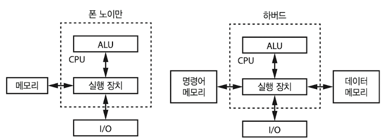

---

## 5.1 processor core

위에서 살핀 두 구조는 CPU가 하나뿐이었다. 그러나 **multiprocessor** 시스템이 등장하면서, 여러 CPU을 활용하게 되었다.

> 대신 여러 CPU를 활용할 수 있도록 프로그램을 **parallelized**(병렬화)해야 하는 문제가 생긴다.

반도체 칩은 점점 더 작아졌으며 기계는 더 빨라졌지만, 이 때문에 전력을 더 많이 소모하면서 단위 면적당 열 발생이 늘어났다. 회로를 이루는 물질이 녹는점 이상으로 올라가는 것을 방지하면서 소형화하는 방안을 모색하기 어려워진 것이다.(이 문제를 **power wall**, 전력 장벽이라고 부른다.)

회로가 작아지면서 예전에 CPU라고 부르던 것을 지금은 **processor core**(프로세서 코어)라고 부른다. 이런 core가 여럿 들어가는 **multicore**(멀티코어) processor가 일반적으로 쓰이게 됐다.

---

## 5.2 microprocessor와 microcomputer

물리적인 패키징으로도 구조를 구분할 수 있다. 

- **microprocessor** : 마이크로프로세서. memory와 processor core가 서로 다른 패키지에 존재한다.

- **microcomputer** : 마이크로컴퓨터. memory와 processor core가 한 칩 안에 패키징되어 존재한다.

microcomputer는 칩에서 memory가 차지하는 영역이 큰 탓에 일반적으로 microprocessor보다 성능이 떨어진다. 따라서 주로 microcomputer는 전자제품의 단일 칩으로 들어가 작은 컴퓨터 역할을 하게 된다.

> 대표적으로 Arduino(아두이노) 같은 것이 AVR microcomputer 칩을 기반으로 만들어진 하버드 구조 컴퓨터다.

추가로 **SoC**(System on a Chip, 단일 칩 시스템)으로 불리는 변형도 존재한다. 더 복잡한 microcomputer를 뜻하며, 상대적으로 간단한 I/O를 제공하는 대신 WiFi 회로 등 더 복잡한 장치가 들어 있다.

> 심지어 원하는 대로 커스텀이 가능한 **FPGA**(field programmable gate array)를 제공하는 SoC도 있다.

---

## 5.3 프로시저, 서브루틴, 함수

function(또는 procedure, subroutine)을 이용해서 코드를 reuse할 수 있다. 자바스크립트로 세제곱 값을 반환하는 함수를 만들었다.

```JavaScript
function cube(x) {
    return (x * x * x);
}

y = cube(3);
```

이제 이 함수를 여러 번 **invoke**(호출)하면 계속해서 어떤 수의 세제곱 값을 얻을 수 있다. 그렇다면 어떻게 이런 코드가 작동할까?

함수가 작동하기 위해서는 invoke를 했을 때, 함수를 실행하고 다시 원래 자리로 돌아올 방법이 필요하다. 이를 위해서는 어디서 함수를 invoke했는지 기억해 둘 필요가 있다. 이 위치가 바로 **program counter**의 값이다.

다음은 함수 호출이 진행되는 과정을 나타낸 것이다. 프로그램 시작(100번지)부터 나타낸다.

| address | instruction | operand | 설명 |
| --- | --- | --- | --- |
| 100 | pca | | program counter 값 $\rightarrow$ accumulator |
| 101 | add | 5(immediate) | 원래 자리에 해당하는 address(100 + 5) |
| 102 | store | 200(direct) | 돌아올 원래 자리를 memory(200)에 저장 |
| 103 | load | 3(immediate) | 세제곱할 값(함수의 parameter)을 accumulator에 load |
| 104 | bra | 300(direct) | cube 함수를 invoke(분기) |
| 105 | | | cube 함수 실행 전 원래 위치에 해당하는 address |
| ... | | | |
| 200 | | | 원래 위치를 저장해 두기 위해 확보해 둔 address |
| ... | | | |
| 300 | | | cube 함수 시작 부분 |
| ... | | | cube 함수의 나머지 instruction들 |
| 310 | bra | 200(indirect) | 저장해둔 주소로 돌아간다(indirect addressing을 이용해 분기) |

> 이렇게 함수에서 돌아오는 것을 **return**이라고 한다.

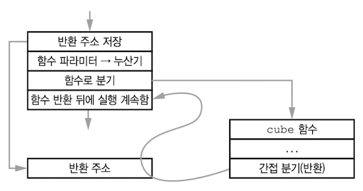

- return address는 여러 필요한 코드 address를 배정한 뒤, 시작 지점에서 5개 명령어가 지난 105에 위치하게 됐다.

위가 이 과정을 요약한 그림이다. 대부분의 기계는 이런 과정을 돕는 instruction을 제공한다.

> 예를 들어 ARM processor에서는 Branch with Link(link register를 사용한 branch) instruction이 있다. 이 instruction은 함수 invoke와 현재 instruction의 다음 위치를 저장하는 기능을 합친 것이다.

---

## 5.4 stack

하지만 함수는 다른 함수를 호출하거나 **recursion**(재귀)하는 경우도 있다. 특히 recursion은 매우 유용하게 사용할 수 있다. **JPEG**(Joint Photographic Experts Group) 압축 예시를 보자. 아래는 JPEG 압축을 진행할 흑백 그림이다.

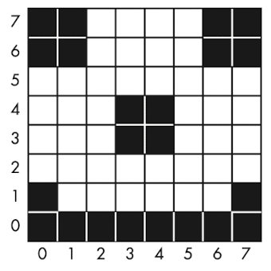

**recursion subdivision**(재귀적 분할)을 사용해 압축을 진행할 것이다. 모든 pixel을 네 부분으로 나누고, 각 부분을 검사한 뒤 이 과정을 1픽셀짜리 조각이 생길 때까지 반복한다.

```JavaScript
function subdivide(x, y, size) {
    // size가 1이거나 정사각형 픽셀 안이 모든 같은 색(구현 생략)이면
    if ( size = 1 || color = 1 ) {
        // 정사각형 정보를 저장
    } else {
        // 사분면의 size를 절반으로 나눈 뒤 재귀를 적용한다.
        half = size / 2;
        subdivide(x, y, half);
        subdivide(x, y + half, half);
        subdivide(x + half, y, half);
        subdivide(x + half, y + half, half);
    }
}
```

이 재귀 과정을 tree로 표현하면 다음과 같다.(수학에서는 DAG(directed acyclic graph)라고 부른다.) 원래 이미지는 64 픽셀이었지만, 압축을 진행하자 픽셀 수가 40으로 줄었다.

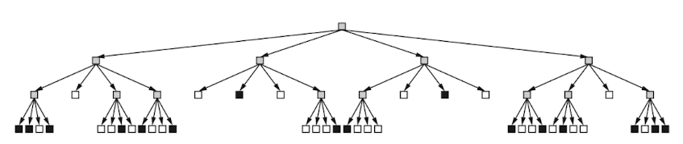

> 각 node에서 가지가 4개 뻗어나가는 tree이기 때문에 quadtree라고 부른다. 이 quadtree는 **spatial data structure**(공간 데이터 구조)에 속한다.

> 더 이상 아래로 내려갈 화살표가 없으면 옆에 있는 화살표로 넘어가는 방식은, **depth-first traversal**(깊이 우선 순회)라고 한다. 반대로 옆에 있는 화살표를 먼저 방문하고 그 후 아래로 내려가면 **breadth-first traversal**(너비 우선 순회)라고 한다.

그런데 이전에 살핀 함수는 return address를 한 군데에만 저장했다. 즉, 이 방식대로는 return address를 덮어쓰기 때문에 재귀 함수를 구현할 수 없다.(사실 이 방식이라면 recursion이 아니라도 함수 내에서 다른 함수를 호출하는 것이 불가능하다.)

따라서 이런 문제를 해결하려면 return address를 여럿 저장할 수 있게 구성해야 한다. 또한 return마다 어느 지점으로 돌아갈지를 결정할 수 있어야 한다. 또한 한번 return하면 더 이상 return address는 기억할 필요가 없다.

이를 **stack**(스택)을 이용해 해결할 수 있다. 접시 맨 위의 return address로 return한 뒤 제거하면 다음 return address를 사용할 수 있다.(LIFO, last in, first out) 함수 invoke마다 address를 **push**하고, return을 할 때는 **pop**을 해서 address를 가져온다.

> push하면서 더 이상 공간이 없으면 이를 **stack overflow**, 반대로 빈 stack에서 무언가 가져오려고 하면 **stack underflow**라고 한다.

> 소프트웨어로 stack overflow를 검사하지 않아도 되도록 돕는 **limit register**도 존재한다. 소프트웨어가 제한을 넘어선다면 **exception**을 발생시킨다.

return address를 예시로 들었지만, **local variale**(지역 변수)도 stack으로 기억한다. 이렇게 각각의 함수 호출이 서로 독립적이게 된다. 이렇게 invoke마다 stack에 저장되는 데이터 모음을 **stack frame**이라고 한다.

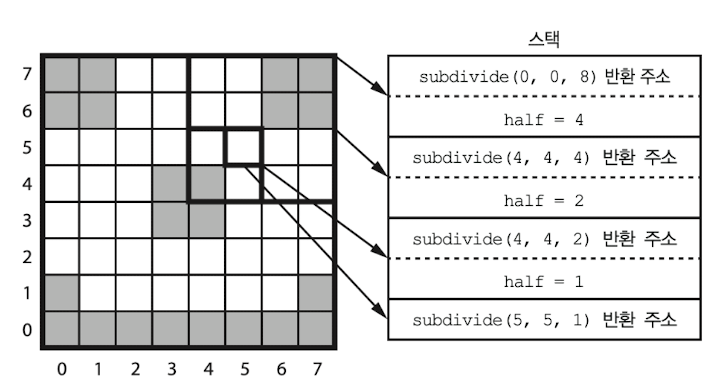

- x, y가 (0, 0)이 되는 지점은 왼쪽 모서리 하단이다.

> 한국어나 일본어도 stack 기반 언어이다. 자음을 스택에 넣고, 그 다음 오는 모음을 스택에 있는 자음에 적용한다.

---

### 5.4.1 stack을 이용한 수식 표기

operator(연산자)와 operand(피연산자)를 배열하는 방법은 여러가지가 있다.

- infix notation

우선 수학에서 익히 잘 사용하는 방법이 바로 **infix notation**(중위 표현법)이다. operand 사이로 operator가 들어간다. 또한 연산 순서를 위해 괄호를 사용한다.

$$ (1+2) \times (3+4) $$

- perfix notation(Polish noation)

**perfix notation**(전위 표기법)은 operand 앞에 operator를 표기한다. 앞서 infix notation으로 쓴 수식을 perfix notation으로 쓰면 다음과 같다.

$$ \times + 1 2 + 3 4 $$

- RPN(reverse Polish notation)

**RPN**(reverse Polish notation, 역 폴란드 표기법)은 operand 뒤에 operator를 표기한다.

$$ 1 2 + 3 4 + \times $$

이 중에서도 RPN은 stack을 사용하면 쉽게 구현할 수 있다. 

1. operand가 stack에 push된다.

2. operator 차례에는 stack에서 operand를 가져와서 연산을 수행한다.

3. 수행한 연산 결과를 다시 stack에 push한다.

> 1 2를 12와 구별하기 위해 ENTER 키가 존재하는데, 이 경우 enter가 있다면 이를 기준으로 operand를 stack으로 push하게 된다.

---

## 5.5 interrupt

CPU가 연산 중에도 주의를 기울여야 하는 작업이 발생할 수 있다. 이 경우 현재 실행 중인 program을 중단하고 다른 프로그램을 실행시킬 필요가 있다. 이런 execution unit 기능 중 하나를 바로 **interrupt**라고 한다.

최근 processor는 interupt system을 포함하며, 특정 신호가 들어오면 CPU 실행을 잠깐 interrupt하는 pin이나 전기 연결을 포함한다. 많은 processor 칩이 **integrated peripheral**(통합 주변장치)를 가지고 있고(on-chip I/O device라고 한다), 이 장치들은 내부적으로 interrupt system에 연결되어 있다.

> **pin**(핀)이란 칩에 연결된 전기적 접점을 뜻한다.

CPU가 주의를 기울여야 하는 peripheral은 interrupt request를 생성하다. 요청을 받은 processor는 잠시 현재 program을 interrupt하고, **interrupt handler**(인터럽트 핸들러)라는 다른 program을 실행하기 시작한다.

> interrupt에 대응하는 것을 **service**라고 한다.

> interrupt handler는 function이다.

여기서 고려해야 할 요소가 몇 가지 있다.

- response time : 응답 시간. interrupt를 받아도 너무 오래 service를 하면 어떠한 문제가 생길 수 있다. 따라서 response time을 정해둔다.

- 현재 **state**를 저장 : service 이후 다시 원래대로 돌아오기 위해서 현재 state(상태)를 저장할 필요가 있다.

  - 예를 들어 service 전 program이 register에 어떤 값을 저장하고 있었다면, interrupt handler는 그 register를 저장했다가, service 이후 돌아오기 전에 이 값을 복구한다. (따라서 덮어쓸 모든 register를 stack에 저장하는 과정을 거치게 된다.)

  - service 이후 돌아올 program 위치는 stack으로 저장한다.

그렇다면 interrupt를 대응하는 함수 interrupt handler의 위치를 어떻게 찾을까? 보통은 interrupt handler address가 따로 저장되는 memory address가 존재한다. 이 address에 여러 **interrupt vector**가 들어 있고, 이 interrupt vector가 각 interrupt에 해당하는 handler address를 지정한다.

> interrupt vector(인터럽트 벡터)는 단지 memory address를 가리키는 pointer일 뿐이다.

컴퓨터는 service를 위해 interrupt vector에 저장된 address를 살펴보고, 제어를 그 address로 옮기게 된다.(즉, <U>program counter를 interrupt vector에 저장된 값으로 설정</U>하게 된다.)

> 많은 기게가 물리적인 address를 벗어나려고 하거나, stack overflow를 일으키는 등 예외 상황에서 interrupt vector를 제공한다. exception을 interrupt handler가 문제를 해결하면서 계속 program을 실행할 수 있는 경우도 존재한다.

또한 interrupt의 on/off와 priority도 설정할 수 있다. **mask**(마스크)를 사용하면 interrupt를 중단할 수 있다. priority를 설정해 두면, 더 중요한 interrupt를 먼저 처리한다.

> 대부분의 기계는 일정 시간이 지나거나, 일정 시간 간격으로 interrupt를 발생시킬 수 있는 내장 timer도 가지고 있다.(일정 시간마다 어느 program을 우선적으로 실행하는 방식으로 사용할 수 있다.)

---

## 5.6 relative addressing

그렇다면 여러 program을 동시에 실행시키려면 어떻게 해야 할까? 우선 각 program을 전환시켜 줄 수 있는 일종의 관리자 program이 필요하다. 이를 OS 또는 OS **kernel**이라고 부른다.

> OS와 OS가 관리하는 program을 구분하기 위해, OS를 **system program**이라고 부른다. 다른 모든 program은 user program이나 **process**(프로세스)라고 한다.

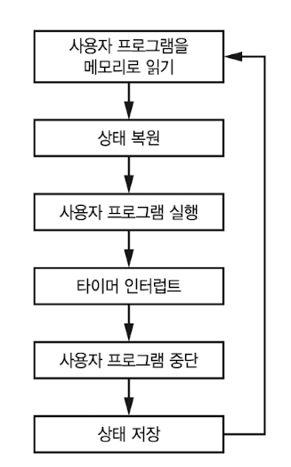

위는 간단하게 나타낸 OS 작동 방식이다. OS는 timer를 사용해서 process(user program)의 실행 시간을 조절한다. 이런 scheduling(스케줄링) 기법을 **time slicing**(시분할)이라고 한다.

> [schedular와 dispatcher의 차이](https://clucle.tistory.com/entry/Scheduler%EC%99%80-Dispatcher%EC%9D%98-%EC%B0%A8%EC%9D%B4)

time slicing에서는 시간을 정해진 간격으로 나누고, 그 간격 동안 process를 실행한다. 

> 이때 process에서 사용하는 register나 memory의 상태를 process **state** 또는 **context**(문맥, 컨텍스트)라고 한다.

그런데 매번 program을 불러들이지 않고, 여러 program을 memory에 넣을 수 있다면 더 빠르게 time slicing이 가능할 것이다.

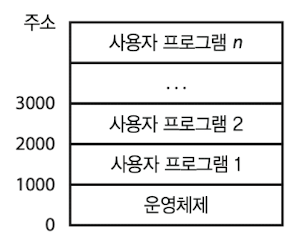

그렇데 제각각인 program을 어떻게 하나씩 memory에 올릴 수 있을까? 방법은 어떤 addressing인가에 따라 다르다.

- absolute addressing

instruction address가 특정 memory address를 가리키는 것을 **absolute addressing**이라고 한다. 따라서 address 1000을 실행하도록 만들어진 program을 2000에서 실행하면 제대로 작동하지 않을 것이다.

이때는 **index register**(인덱스 레지스터)를 추가해 해결한다. index register에 든 값을 instruction address와 더해서 **effective address**(유효 주소)로 보정하는 것이다.

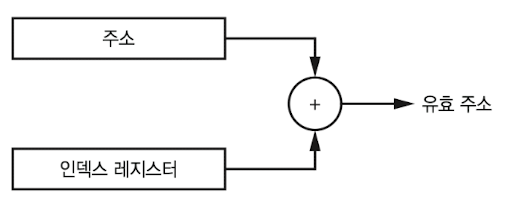

- relative addressing

**relative addressing**(상대 주소 지정)을 사용하면, instruction address를 (일반적인 memory 시작 부분에 해당하는 address인) 0이 아닌 다른 값으로 해석한다. 

> instruction을 읽으면 pc가 계속 증가하므로, 이 현상을 보정해주는 것과 마찬가지다. 

4.3.4절 예제에서 피보나치 수열을 계산하기 위해 다음과 같은 instruction을 사용한 적이 있었다. 

| address | instruction 전체 |
| --- | --- |
| 0001 | 00 0111 0001100100 |

- accumulator에 있는 값(0)을 memory address 100에 저장한다.

- 00 : direct

- 0111 : store

- 0001100100 : address

relative addressing을 이용한다면, address 101에 save되지 않도록 값을 99로 바꿔준다. 이번엔 예제에서 분기를 수행한 instruction도 보자.

| address | instruction 전체 |
| --- | --- |
| 1100 | 00 0111 0000000100 |

- 00: direct

- 0111 : store

- 0000000100 : memory 위치 4로 분기

relative addressing을 이용한다면, address 12로 분기되지 않도록 -8로 바꿔준다.

요즘의 프로그래밍 언어는 알아서 바꿔주므로 이런 과정을 직접 계산하지는 않아도 된다. 또한 relative addressing을 사용하면 memory의 원하는 address로 자유롭게 **relocate**(재배치)할 수 있다.

---

## 5.7 MMU

앞서 설명한 index register나 relative addressing이 multitasking에 도움은 되나 충분하지는 않다. 버그가 생겨 program끼리 memory를 덮어쓰거나, 심지어 OS의 memory를 덮어쓰는 일이 발생할지도 모른다. 이런 불상사를 방지하기 위해 **MMU**(Memory Management Unit, 메모리 관리 장치)를 사용한다.

MMU는 **virtual address**(가상 주소)와 **physical address**(물리 주소)를 구분한다. program은 virtual address로 작성되고, MMU가 이를 physical address로 **translation**(변환)하면서 여러 문제를 방지한다.

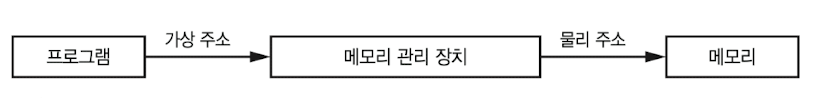

그런데 MMU의 virtual address 범위는 보통 physical address보다 큰 경우도 많다. MMU는 virtual address를 두 부분으로 나눈다.

- 하위(LSB 쪽) address는 physical address 범위와 같다.

- 상위(MSB 쪽) address는 **page table**(페이지 테이블)이라는 RAM 영역을 통해 주소를 translation한다. 

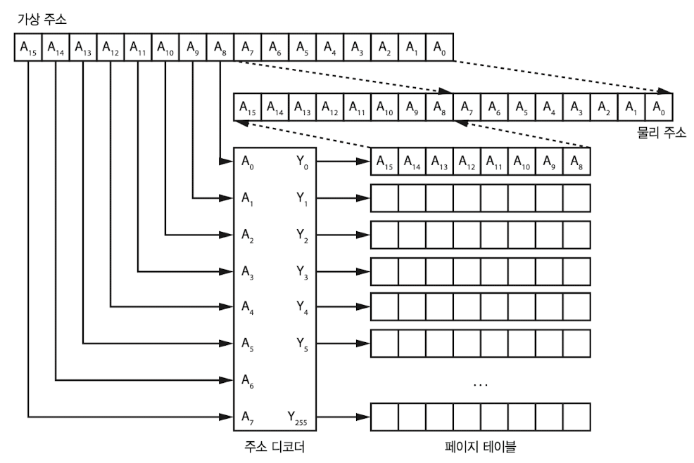

위가 16bit address를 translation하는 방법을 표현한 것이다. memory는 256byte 크기의 **page**(페이지)로 분할된다. page table에는 각 page가 physical memory상에 차지하는 실제 address 정보가 존재한다.

> 물론 모든 내용이 **page boundary**(페이지 경계) 안에 들어 있어야 한다.

잘 생각해 보면 연속적으로 보이는 virtual memory와 다르게 physical memory는 굳이 연속적일 필요가 없다. 게다가 program 실행 도중에도 program이 위치한 physical address가 바뀌기도 한다. 또한 program이 서로 협력하는 경우, virtual address 일부를 함께 사용할 수도 있다.(이를 **shared memory**(공유 메모리) 기능이라고 한다.)

---

### 5.7.1 page 관리

하지만 16bit만 해도 page가 굉장히 늘었다. 64bit라면 4GiB의 page table이 필요하고 page 크기도 4GiB가 될 것이다. 하지만 이런 조건을 만족하지 못하는 시스템이 많이 존재하므로 문제가 생긴다.

전체 **page table entry**(페이지 테이블 항목)은 주 memory에 저장되는데, 만약 주 memory가 부족하면 disk에 저장된다. 그리고 MMU는 저장된 page table 항목 중 일부를 필요할 때만 자신의 page table로 읽어 들인다.

일부 MMU는 page table에 control bit를 제공한다. 이런 control bit의 대표적인 예시로 no execute bit가 있다.

**no execute bit**(실행 불가 비트)는 어느 page에 no execute bit가 설정되어 있으면, CPU는 이 page에 있는 instruction을 실행할 수 없게 만든다.

> program의 실수를 방지하는 데 유용하며, 프로그램을 마음대로 바꿔 쓸 수 없게 만든다.

> 또 다른 일반적인 control bit로 page를 read only로 바꾸는 bit도 존재한다.

또한 program이 physical address와 연관이 없는 주소에 접근하면 **page fault** exception이 발생한다. 이런 동작은 stack overflow 등이 일어날 때 유용하게 쓸 수 있다.

> stack overflow가 발생하면 stack 범위에 벗어나는 address에 접근하게 된다. 그렇게 page fault exception이 일어났을 때, program을 중단하는 대신 MMU가 추가 memory를 할당하게 하면 문제를 해결할 수 있다.

참고로 단일 memory bus를 사용하는 폰 노이만 구조의 시스템도 MMU를 이용해서 instruction memory와 data memory를 분리해서 제공할 수 있다. 사실상 하버드 구조와의 구분이 의미가 없어지는 셈이다.

---

## 5.8 virtual memory

이처럼 OS는 program들 사이에서 자원 분배를 관리한다. 따라서 memory 역시 OS가 관리하는 자원인데, OS는 MMU를 이용해 process에게 **virtual memory**(가상 메모리)를 제공한다.

앞에서 MMU가 virtual address를 physical address로 translation했다. 하지만 virtual memory는 그 이상이다. page fault 메커니즘으로 program은 필요한 만큼(virtual memory address 범위 내에서) 많은 memory를 가진다고 판단할 수 있게 되었다. 

만약 사용 가능한 (physical) memory 크기보다 더 필요하다면 다음과 같은 과정을 거친다. 아래 과정처럼 page를 처리하는 것을 통틀어 **demand paging**(요구불 페이징)이라고 한다.

- OS는 현재 필요하지 않은 memory page를 더 느리지만 용량은 큰 disk로 옮긴다.

> 이 과정을 **swap out**(스왑 아웃)이라고 부른다. 

- 만약 program이 이 page에 접근하면, OS는 다시 이 요청받은 page를 다시 memory로 불러들인다. 

> 이렇게 불러들이는 과정은 **swap in**(스왑 인)이라고 한다.

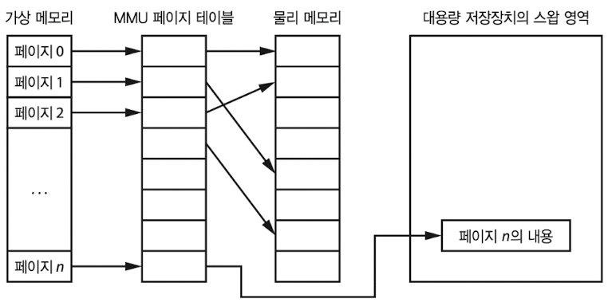

위 그림이 virtual memory에서 일어난 swap out을 표현한 것이다. 다만 swapping(swap in 혹은 swap out, 스와핑)이 일어나면 시스템 성능이 크게 저하된다. program을 실행하지 못하는 것보다는 느린 속도라도 program을 동작시키는 방법에 가깝다.

swapping에 의한 성능 저하를 막는 여러 기법도 존재한다. 대표적으로 **LRU**(least recently used, 최소 최근 사용) 알고리즘이 있다. 이 알고리즘은 page 접근을 추적해서 swap out할 page를 결정한다. 

> LRU는 최근 가장 사용한 page는 남기고, 가장 덜 사용한 page를 swap out한다.

---

## 5.9 시스템 공간과 사용자 공간

MMU가 각 process에 자신만의 memory address 공간을 제공하면서 multitasking이 가능했다. 하지만 I/O device가 끼어드는 순간 고려해야 할 부분이 생긴다.

OS는 초당 발생한 interrupt 횟수에 맞춰 timer를 설정한다. 하지만 process가 마구잡이로 이 timer의 설정을 변경하면, MMU가 program들을 서로 격리시키는 데 문제가 생길 것이다.

때문에 CPU는 이런 문제를 해결할 수 있는 추가 하드웨어를 제공한다. CPU는 컴퓨터가 **system mode**(시스템 모드)에 있는지, **user mode**(사용자 모드)에 있는지 결정하는 bit를 어느 register 안에 가지고 있다.

> I/O를 처리하는 instruction 등 일부 instruction은 **privileged**(특권) instruction라서, <U>오직 system mode에서만 실행</U>할 수 있다.

> **trap**(트랩)이나 **system call**(시스템 콜)이라고 부르는 특별한 instruction을 통해 process가 system mode process(즉, OS)로 요청을 보낼 수 있다.

이런 방식으로 OS와 다른 process를 동시에 보호할 수 있다. 또한 MMU 등 몇몇 요소에 사실상 접근할 수 없기 때문에, OS가 process에게 자원 할당을 전적으로 제어할 수 있게 된다.

---

## 5.10 memory hierarchy와 성능

과거에는 CPU와 memory가 같은 속도로 작업했지만, 현재는 CPU 속도가 memory보다 훨씬 빠르기 때문에 CPU가 memory를 기다려야 하는 상황이 발생했다. 따라서 이런 기다리는 과정에서 아무 일도 하지 않는 일을 방지하기 위해 여러 방법을 적용하기 시작했다.

> processor는 보통 RAM으로 이뤄진 **main memory**(주 메모리)와 통신하는데, main memory는 processor보다 약 1/10 정도밖에 속도가 나지 않는다.(심지어 disk drive 같은 장치는 백만 배 가까이 느릴 수 있다.)


> [paging game](https://www.gnu.org/fun/jokes/paging.game.html): memory 비유 문서. 또 다른 비유로는 register는 작지만 빠르게 음식을 꺼내올 수 있는 냉장고와 같고, main memory는 공간은 넓지만 시간이 더 걸리는 가게와 같다.(disk drive는 훨씬 먼 대형 창고에 가깝다.)

virtual memory와 swapping은 **memory hierarchy**(메모리 계층)이라는 개념과 관련이 있다. memory 접근 속도에 차이가 나는 만큼 hierarchy를 나눠서, 중요한 정보를 빠르게 가져올 수 있게 하는 것이다.

이 중에서도 **cache**(캐시)라는 on-chip memory 하드웨어, 즉 CPU에 이 하드웨어를 추가하면 작지만 훨씬 빠르고 processor와 같은 속도로 동작한다. 또한 아래 현상들을 이용해서 시스템 성능을 높인다.

- 분기가 없는 memory는 순서대로 읽어온다.

- (DRAM을 읽을 때) row보다 column으로 memory를 읽는 방식이 더 빠르다.

- program이 사용하는 data는 한데 모인 경우가 많다.

**CPU memory controller** 하드웨어는 memory에서 연속된 column에 있는 data를 한꺼번에 가져온다. 대부분 가까운 위치에 있는 data가 필요하기 때문이다. 만약 이렇게 가져왔을 때 의도와 맞는 data가 없는 **cache miss**(캐시 실패) 현상이 일어나더라도, CPU는 고속으로 memory access가 가능하기 때문에 여전히 유리하다.

> 반대로 cache에서 제대로 원하는 내용을 가져온 것을 **cache hit**(캐시 적중)이라고 한다.

cache memory에도 몇 가지 hierarchy가 있다. 모든 cache가 같은 칩에 존재하더라도, CPU에서 멀어질수록 cache는 더 느려지고 더 커진다. 이들을 L1, L2, L3 cache라고 부른다.(L은 level을 의미. 커질수록 느리고 저렴하다)

여기서 더 복잡한 수정을 가해서 성능을 더 향상시킬 수 있다. 또한 기계는 memory에서 **prefetch**(미리 fetch)하며 cache를 준비하는데, 이런 prefetch를 위해 조건 분기 instruction의 결과를 예측하는 **branch prediction**(분기 예측) 회로가 존재한다.

> **out-of-order execution**(순서를 벗어나는 실행)을 처리하는 회로도 존재한다. 이 회로는 CPU가 program에 명시된 intruction 순서를 벗어나서 가장 효율적으로 instruction을 수행하게 해준다.

---

