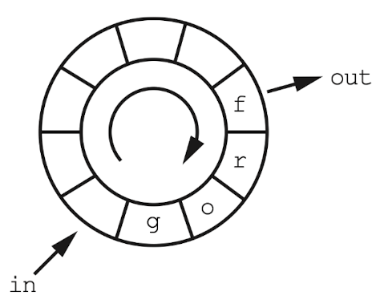

# 10 application programming과 system programming

동물 추측 게임을 C programming으로 작성할 것이다. 터미널 프로그램에서 y나 n을 입력하고 (키보드에 따라) ENTER나 RETURN이나 ↵키를 누를 것이다. q를 입력으로 받으면 종료된다.

---

## 10.1 프로그램 빌드

C는 컴파일 언어이기 때문에 source code를 먼저 기계어로 변환해야 한다. 그리고 이 출력 파일의 이름을 타이핑해서 파일을 실행할 수 있다. 아래는 그 예시다.

```bash
gcc gta.c -o gta
```

- 'gcc': C compiler

- 'gta.c': source file 이름

- '-o': 출력 파일 이름 앞에 쓰는 옵션

- 'gta': 출력 파일 이름

---

## 10.2 터미널과 장치 드라이버

터미널은 I/O 장치이며, user program은 I/O 장치와 직접 통신하지 않는다. 대신 OS가 중간에서 통신을 중재한다.


> 과거 터미널이 별도의 장치였을 때도 있었다. 컴퓨터와 터미널이 RS-232 직렬 연결로 물리적으로 연결되었지만, 오늘날 OS는 마치 이런 연결이 진짜 존재하는 것처럼 software로 흉내내서 동작한다.

---

## 10.3 context switching

device driver는 보기보다 복잡하다. OS는 한 번에 user program을 두 개 이상도 실행할 수 있는데, register set은 하나뿐이므로 OS는 한 user program을 다른 user program으로 바꿀 때마다 register들을 저장하고 복구해야 한다. 

또한 CPU register 외에도 저장하고 복구해야 할 내용이 많다. 예를 들어 MMU(Memory Management Unit) register나 I/O state 등도 저장하고 복구해야 한다. 이때 저장하고 복구해야 하는 모든 내용을 **process context**(프로세스 문맥) 혹은 간단히 **context**(문맥)이라고 부른다. 

**context switching**(문맥 전환)으로 소모되는 cost는 비싸기 때문에, 경솔하게 자주 해서는 비싼 cost를 계속 지불해야 할 것이다. 우선 system call이 이루어지는 과정을 살펴보자.


> 요청을 만족시킬 수 있는 경우에도 다른 user program이 실행될 기회를 주기 위해, 현재 실행 중인 user program을 sleep시키는 경우도 있다.

user가 키를 누를 때마다 context switching이 일어나서는 안 될 것이다. 따라서 이를 방지하기 위해 user가 ENTER 키를 누를 때까지는 user가 무엇을 입력하든 상관이 없게 만들었다. 따라서 user가 ENTER 키를 누르기 전까지는 user program은 대기 외에는 할 일이 없어서 sleep 상태가 된다.(즉, OS는 다른 program을 실행하는 등 다른 동작을 수행할 것이다.)

> 이외 user program을 깨우는 program이나 문자를 지우는 키(BACKSPACE나 DELETE 키 등)를 지정할 수도 있다.

물리적 장치와 관련된 처리를 담당하는 **device driver**(장치 드라이버)는 터미널에 들어오는 문자를 **buffer**(버퍼)에 저장하고, user가 무엇을 입력하든 sleep하고 있던 user program을 ENTER 키를 눌렀을 때 '**wake-up**'시킨다.

software 영역에서 buffer는 FIFO data structure이다. 이를 다른 말로 **queue**(큐, 대기열)이라고도 한다. stack과 마찬가지로 공간을 다 쓰면 overflow가 발생하고, 빈 queue에서 element를 꺼내려고 하면 underflow가 발생한다.


터미널에서 키보드와 디스플레이 사이에는 직접적인 연결이 없다. 키보드는 컴퓨터에 data를 보내고, 디스플레이는 컴퓨터에서 data를 받는다. 그런데 이때 user가 입력한 것을 화면에 바로 표시해 주기 위해서는 **echo**(에코)가 필요하다.


> 실제 device driver는 더 복잡하다. driver 설정을 변경하기 위해 추가된 system call도 있다. echo를 끄거나 켤 수 있으며, buffering이 꺼져 있는 경우를 **raw mode**라고 부르고, 켜져 있는 경우를 **cooked mode**라고 한다.

또한 user 키 입력은 program이 display에 보내는 output보다 느리기 때문에, 이를 조절하기 위해 **input buffer**(입력 버퍼) 외에도 **output buffer**(출력 버퍼)가 필요하다. 

> output buffer가 꽉 찼는데도 program이 터미널에 output을 시도하면, program을 sleep mode로 전환한다. input buffer가 꽉 찬 경우에는 driver가 user에게 화면을 깜빡이거나 삐 소리를 울리는 등의 피드백을 제공할 수도 있다.

---

## 10.4 standard I/O

device driver 내의 buffering은 문제 중 일부만 해결해준다. user program에도 비슷한 문제가 있다. device driver가 input을 buffering해도, user program이 문자를 입력할 때마다 system call을 호출하면 input buffer가 아무런 쓸모가 없을 것이다. 

이것이 **standard input/output**(표준 입/출력) library(stdio)가 탄생한 이유다. standard input/output library에는 user program이 쓸 수 있는 buffer I/O function이 들어 있다.

`stdio` library는 buffer input을 지원한다. buffer input을 사용하면 system call을 한 번만 사용해서 device driver에서 읽은 data를 buffer에 넣을 수 있다. user program은 buffer가 빌 때까지 buffer에서 input 문자를 얻고, 전부 비면 다시 system call을 통해 input을 더 가져온다.

출력하는 경우에는 buffer가 꽉 차거나 중요한 문자(예를 들면 새 줄 문자(newline))가 출력될 때까지 buffer에 들어간다.


그러면 어떻게 user program을 터미널 device driver와 연결할 수 있을까? 누군가를 가리킬 때는 특정 이름을 사용하는 것이 편리하단 점을 생각하자. `open` system call은 파일명을 **handle**(핸들)이나 **file descriptor**(파일 디스크립터)로 바꿔서 파일을 참조할 수 있게 만든다. 이 handle을 system call로 `close`하면 더 이상 handle을 사용할 수 없다.

`stdio` library는 `open` 및 `close`에 대응되는 `fopen`과 `fclose` function을 제공한다. 이 두 function은 `open`, `close` system call을 사용하되, 파일을 `open`해서 handle을 얻을 때 buffer를 설정하고, 파일을 `close`할 때 buffer를 해제해 준다.

> 유닉스는 device를 파일처럼 추상해 주므로 /dev/tty 등의 특별한 파일을 열면 터미널 장치에 접근할 수 있다.

---

## 10.5 원형 버퍼

queue가 어떻게 동작하는지 살펴보자. 다음은 'frog'란 문자열을 queue에 집어넣는 예시다.


- 새 값을 집어넣기 위해서는 줄의 맨 끝을 계속 추적해야 한다.

이제 이 'frog'를 queue에서 출력한다고 하자.


- f가 빠지면서 r은 f가 있던 자리로 복사된다. o는 r이 있던 자리, g는 o가 있던 자리로 복사된다.

이는 너무 작업이 많이 필요하므로 다른 방식으로도 구현할 수 있다.


- queue의 앞부분을 가리키는 pointer를 한 칸씩 이동하면서 element를 출력한다.

이 방식이 일은 덜 할 수 있으나 새로운 문제가 생긴다. 어느 시점에서 앞에 충분히 빈 공간이 있어도 queue 시작 pointer가 뒤에 존재하게 된다. 만약 맨 뒤 시점까지 이동했다면 queue에 아무것도 들어올 수 없을 것이다.

이런 문제를 해결할 수 있는 방법으로 **circular buffer**(원형 버퍼), **circular queue**(원형 큐), **ring buffer**(링 버퍼)라고 불리는 방법을 사용할 수 있다.



- 입력: in pointer가 out pointer를 따라잡을 때까지는 queue에 element를 추가할 수 있다.

- 출력: out pointer가 in pointer를 따라잡을 때까지는 queue에 element를 제거할 수 있다.

> 물론 array index가 buffer의 끝에서 다시 맨 앞으로 돌아오게끔 계산식을 만들어야 한다.

---

## 10.5 추상화를 활용한 코드 개선

동물 추측 게임을 할 때, 마지막 게임 state를 저장했다가 나중에 그 state에서 다시 게임을 수행할 수 있다면 편리할 것이다. C program으로는 파일 추상화 덕분에 이런 code를 작성하기 더 쉽다.

---

## 10.6 runtime library와 standard I/O

C program을 실행하려면 먼저 작성한 code를 compile한 다음, compile된 code와 이 code가 사용하는 `stdio` library 등의 다른 code를 **link**해야 한다. 이때 runtime library도 포함시켜야 한다.

C에서 runtime library는 `crt0` 등의 이름으로 불린다. runtime library는 stack과 heap을 설정하여 사용할 수 있도록 준비하는 등 여러 설정을 담당한다. 또한 추가로 터미널 device driver와 연관된 파일을, 하나는 input을 위해, 하나는 output을 위해 `open`한다.

`stdio` library는 runtime library가 연 system file descripter를 **file pointer**(파일 포인터)와 연관시킨다. 

> file pointer는 buffering이나 파일 관리에 필요한 data structure를 가리킨다.

`stdio`는 기본적으로 세 가지 file pointer를 제공한다. 


- `stdin`: standard input

- `stdout`: standard output

- `stderr`: standard error print

  > 따라서 program 실행 중 생긴 error 등으로 인해 중요한 정보를 출력해야 한다면, `stdout` 대신 `stderr`에 내용을 출력해야 한다.

`stdout`과 `stderr`는 똑같은 대상으로 data를 보내지만, `stderr`는 `stdout`과 달리 buffer를 사용하지 않는다.(만약 error message를 `stdout` buffer로 보낸다면, message가 buffer에 들어가서 program이 중단되어도 표시되지 않을 수 있다. 따라서 이러한 설계가 된 것이다.)

---

